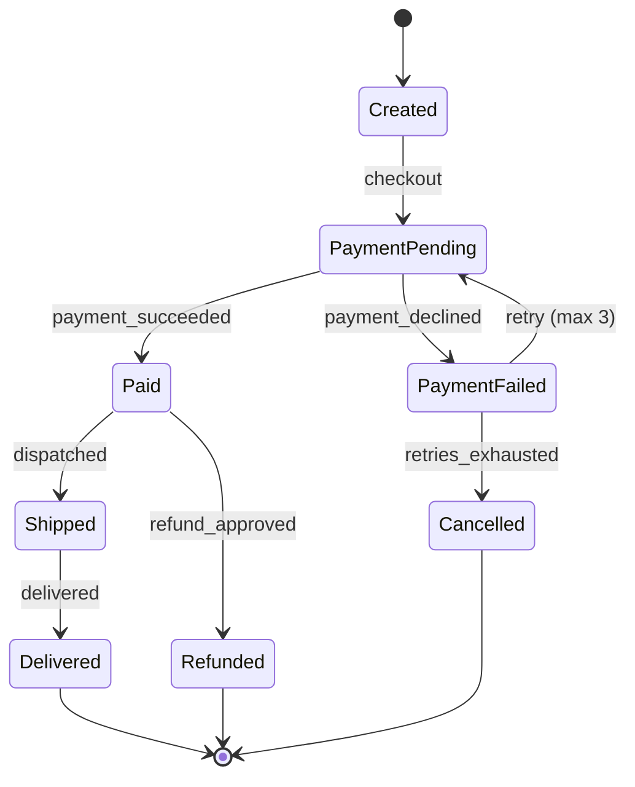
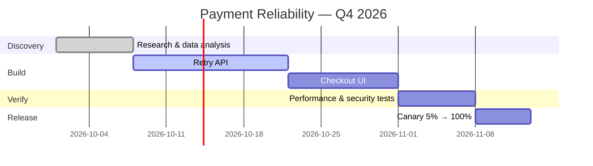

# 📋 Requirements & Planning — Production Engineering Guide

> How to discover, write, validate, prioritise, trace, and plan software requirements so that what gets built is what was needed: requirements engineering per ISO/IEC/IEEE 29148:2018, requirement types, quality characteristics of good requirements, elicitation, EARS and user stories, measurable non-functional requirements (ISO/IEC 25010:2023), prioritisation, templates (PRD, SRS, use case), traceability, change control, estimation, roadmaps, risk management, compliance requirements, and requirements for AI features.
>
> Related: [02 SDLC](./02-software-development-lifecycle.md) · [04 Architecture](./04-software-architecture.md) · [08 Testing & Quality](./08-testing-and-quality.md) · [09 Security](./09-security-engineering.md)

---

## 📚 Table of Contents

1. [Why Requirements Fail](#1-why-requirements-fail)
2. [Requirements Engineering — ISO/IEC/IEEE 29148](#2-requirements-engineering--isoiecieee-29148)
3. [Levels and Types of Requirements](#3-levels-and-types-of-requirements)
4. [Characteristics of Good Requirements](#4-characteristics-of-good-requirements)
5. [Stakeholder Analysis](#5-stakeholder-analysis)
6. [Elicitation Techniques](#6-elicitation-techniques)
7. [Writing Requirements — "shall" Statements and EARS](#7-writing-requirements--shall-statements-and-ears)
8. [User Stories and Acceptance Criteria](#8-user-stories-and-acceptance-criteria)
9. [Non-Functional Requirements](#9-non-functional-requirements)
10. [Modelling Requirements](#10-modelling-requirements)
11. [Prioritisation](#11-prioritisation)
12. [Requirements Documents and Templates](#12-requirements-documents-and-templates)
13. [Traceability](#13-traceability)
14. [Validation and Verification of Requirements](#14-validation-and-verification-of-requirements)
15. [Change Control and Baselines](#15-change-control-and-baselines)
16. [Planning — Roadmaps, Releases, Iterations](#16-planning--roadmaps-releases-iterations)
17. [Estimation](#17-estimation)
18. [Capacity, Dependencies, and Scheduling](#18-capacity-dependencies-and-scheduling)
19. [Risk Management](#19-risk-management)
20. [Compliance and Regulatory Requirements](#20-compliance-and-regulatory-requirements)
21. [Requirements for AI / LLM Features](#21-requirements-for-ai--llm-features)
22. [Scenario Playbooks](#22-scenario-playbooks)
23. [Tooling](#23-tooling)
24. [Checklists](#24-checklists)
25. [References](#25-references)

---

## 1. Why Requirements Fail

| Failure | Typical cause | Prevention |
|---|---|---|
| Built the wrong thing | Solution chosen before problem understood | Problem statement + discovery (§6) |
| Ambiguity | "Fast", "user-friendly", "secure" | Measurable criteria (§4, §9) |
| Missing NFRs | Only features written | NFR checklist from ISO/IEC 25010 (§9) |
| Missing stakeholders | Ops, security, legal, support not asked | Stakeholder map (§5) |
| Scope creep | No baseline, no change control | Baselines + change process (§15) |
| Gold plating | Engineers add unrequested features | Traceability (§13) |
| Untestable | No acceptance criteria | Given/When/Then, EARS (§7–8) |
| Lost context | Decisions in chat threads | Single source of truth + decision log |
| Over-specification | Design dictated in requirements | State *what* and *how well*, not *how* |

> Rule: **a requirement is not done until someone can write a test for it.**

---

## 2. Requirements Engineering — ISO/IEC/IEEE 29148

**ISO/IEC/IEEE 29148:2018** (*Systems and software engineering — Life cycle processes — Requirements engineering*, 2nd edition) is the current international standard for requirements engineering. It replaced the 2011 edition, which in turn superseded IEEE 830-1998 (SRS), IEEE 1233-1998, and IEEE 1362-1998. It:

- defines what a well-formed requirement is, its attributes, and its characteristics;
- describes requirements processes and how they apply iteratively and recursively through the life cycle;
- supplements the requirements-related processes of ISO/IEC/IEEE 12207 and 15288 (or can be used on its own);
- specifies the information items produced (e.g. stakeholder, system, and software requirements specifications) and their content.

### 2.1 Requirements engineering activities

```text
          ┌──────────────┐
          │  Elicitation │  discover needs from stakeholders & sources
          └──────┬───────┘
                 ▼
          ┌──────────────┐
          │   Analysis   │  resolve conflicts, decompose, model, check feasibility
          └──────┬───────┘
                 ▼
          ┌──────────────┐
          │Specification │  write them down precisely
          └──────┬───────┘
                 ▼
          ┌──────────────┐
          │  Validation  │  are these the right requirements?
          └──────┬───────┘
                 ▼
          ┌──────────────┐
          │  Management  │  baseline, trace, change control — continuous
          └──────────────┘
         (all activities iterate; management spans the whole life cycle)
```

### 2.2 Mapping to ISO/IEC/IEEE 12207 technical processes

| 12207 process | Requirements work |
|---|---|
| Business or mission analysis | Problem/opportunity, business requirements, solution space |
| Stakeholder needs and requirements definition | Stakeholder requirements (StRS) |
| System/software requirements definition | System (SyRS) / software (SRS) requirements |
| Verification / Validation | Requirements verified (built right) and validated (right thing) |

---

## 3. Levels and Types of Requirements

### 3.1 Levels (from why to what)

| Level | Question | Owner | Document |
|---|---|---|---|
| **Business requirements** | Why does the organisation need this? | Sponsor, product | Business case / BRS |
| **Stakeholder (user) requirements** | What do users and other stakeholders need to do? | Product, BA | StRS, user stories, use cases |
| **System / software requirements** | What must the system do, and how well? | BA, tech lead | SyRS / SRS, backlog items |
| **Design constraints** | What limits the solution? | Architect | NFRs, ADRs |

```text
Business:     Reduce failed payments by 30% in FY27
Stakeholder:  As a customer, I want to retry a failed payment with another method
System:       The system shall offer alternative payment methods within the same checkout session after a decline
NFR:          The retry flow shall complete within 2 s at p95 under 500 req/s
```

### 3.2 Types

| Type | Description | Example |
|---|---|---|
| **Functional** | Behaviour: inputs, outputs, rules | "Shall send an OTP to the registered mobile number" |
| **Non-functional / quality** | How well (ISO/IEC 25010 characteristics) | "p99 < 300 ms", "99.95% monthly availability" |
| **Data** | Entities, retention, quality | "Retain invoices for 8 years" |
| **Interface** | External systems, APIs, protocols | "Integrate with UPI via the PSP's REST API v3" |
| **Constraint** | Mandated technology, standards, budget | "Must run on the existing PostgreSQL 16 cluster" |
| **Regulatory / compliance** | Laws, standards | "Must support data-principal erasure requests" |
| **Transition** | Migration, training, cut-over | "Migrate 2.4 M legacy accounts with zero data loss" |
| **Operational** | Support, monitoring, deployment | "Shall emit metrics compatible with Prometheus" |

---

## 4. Characteristics of Good Requirements

ISO/IEC/IEEE 29148:2018 defines characteristics for **individual requirements** and for **sets of requirements**. Use them as a review checklist.

### 4.1 Individual requirement

| Characteristic | Meaning | Test question |
|---|---|---|
| **Necessary** | Removing it would leave a deficiency | Who needs this, and why? |
| **Appropriate** | Right level of detail for its level (no premature design) | Is this *what*, not *how*? |
| **Unambiguous** | Only one interpretation | Would two engineers build the same thing? |
| **Complete** | Needs no further amplification | Are conditions, actors, and outcomes all stated? |
| **Singular** | States one capability or characteristic | Does it contain "and/or"? Split it |
| **Feasible** | Achievable within constraints and acceptable risk | Can we build it with current tech, budget, time? |
| **Verifiable** | Can be proven by inspection, analysis, demonstration, or test | How will we test it? |
| **Correct** | Accurately represents the need | Did the stakeholder confirm it? |
| **Conforming** | Follows the agreed template/style | Does it match our requirement format? |

### 4.2 Set of requirements

| Characteristic | Meaning |
|---|---|
| **Complete** | The set covers all needs at its level |
| **Consistent** | No conflicts or duplicates; terminology is uniform |
| **Feasible** | The whole set can be met together within constraints |
| **Comprehensible** | Readers understand what is required and how it fits the system |
| **Able to be validated** | It can be shown that the set will satisfy stakeholder needs |

### 4.3 Ambiguous words to ban (or quantify)

```text
fast, quick, responsive, efficient       → p95/p99 latency at stated load
user-friendly, easy, intuitive           → task success rate, time-on-task, WCAG level
secure, robust                           → specific controls, ASVS level, threat-model items
scalable                                 → load target and growth assumptions
flexible, extensible                     → named extension points / change scenarios
minimal, maximal, optimal                → numbers
etc., and so on, including but not limited to  → enumerate
support, handle, process                 → state the observable behaviour
should (in a contract)                   → use shall / must or mark as optional
```

### 4.4 Requirement attributes

| Attribute | Example |
|---|---|
| ID | `REQ-PAY-042` (stable, never reused) |
| Title | Retry with alternative payment method |
| Statement | The system shall … |
| Rationale | Reduce failed checkouts (OKR-2) |
| Source / owner | Payments PM |
| Priority | Must (MoSCoW) |
| Type | Functional |
| Verification method | Test (automated E2E) |
| Status | Draft → Reviewed → Approved → Implemented → Verified |
| Version | 1.2 |
| Trace links | Parent BR-07; tests TC-PAY-120..124; ADR-0011 |
| Risk | Medium |

---

## 5. Stakeholder Analysis

### 5.1 Stakeholder checklist (people teams forget)

| Stakeholder | What they care about |
|---|---|
| End users (by persona) | Tasks, accessibility, performance |
| Customers / buyers | Price, compliance, integration |
| Product & business owners | Outcomes, ROI |
| Customer support | Diagnostics, admin tools, error messages |
| Operations / SRE | Deployability, observability, runbooks, SLOs |
| Security & privacy | Threats, data protection, audit |
| Legal & compliance | Laws, contracts, licences |
| Finance | Cost of cloud, licences, billing correctness |
| Data / analytics | Events, schemas, data quality |
| Partner & integrating teams | API contracts, versioning, deprecation |
| Accessibility specialists | WCAG conformance |
| Regulators / auditors | Evidence, traceability |

### 5.2 Power–interest grid

```text
            High interest
                 │
   Keep satisfied│ Manage closely
 ────────────────┼──────────────── High power
   Monitor       │ Keep informed
                 │
            Low interest
```

### 5.3 Persona template

```markdown
## Persona: Priya — Small-business owner
- Context: runs a 6-person retail shop in Pune; uses phone more than laptop
- Goals: send GST invoices in < 1 min; see who hasn't paid
- Frustrations: complex forms; poor connectivity in the shop
- Accessibility: prefers larger text; English + Hindi
- Success metric: invoices sent per week without help
```

---

## 6. Elicitation Techniques

| Technique | Best for | Watch out for |
|---|---|---|
| **Interviews** | Deep individual needs | Leading questions |
| **Workshops** (JAD) | Aligning many stakeholders quickly | Loudest voice wins — use a facilitator |
| **Observation / contextual inquiry** | Real workflows, workarounds | Observer effect |
| **Surveys** | Breadth, quantification | Shallow answers |
| **Document & system analysis** | Legacy rules, regulations | Outdated docs |
| **Prototyping / wireframes** | UI and flow validation | Mistaking prototype for product |
| **Event Storming** | Domain events, bounded contexts (DDD) | Needs domain experts in the room |
| **User story mapping** | Release slicing, MVP | Losing NFRs |
| **Example mapping** (BDD) | Rules + examples + open questions per story | Skipping it under time pressure |
| **Support tickets & analytics** | Real pain points, usage data | Survivorship bias |
| **Competitive analysis** | Market expectations | Copying without understanding |
| **Jobs-to-be-Done interviews** | Underlying motivation | Requires skilled interviewers |

### 6.1 Interview question bank

```text
Context:      Walk me through the last time you did <task>.
Pain:         What's the most frustrating part? What happens when it goes wrong?
Workarounds:  What do you do today instead? Spreadsheets? Phone calls?
Frequency:    How often? How many people? Peak times?
Outcomes:     How do you know it went well?
Constraints:  What rules, approvals, or regulations apply?
Exceptions:   What are the unusual cases? What happens at month-end?
Data:         What information do you need, and from where?
Priorities:   If you could change one thing, what would it be?
```

### 6.2 Example mapping (per story, ~25 minutes)

```text
🟨 Story:   Retry failed payment with another method
🟦 Rule:    Only for declines, not for fraud blocks
   🟩 Example: Card declined (insufficient funds) → offer UPI and netbanking
   🟩 Example: Fraud block → show support message, no retry
🟦 Rule:    Max 3 retries per order
   🟩 Example: 4th attempt → order cancelled, cart preserved
🟥 Question: Do we keep the original price if a promotion expired during retry?
```

---

## 7. Writing Requirements — "shall" Statements and EARS

### 7.1 Conventions

| Keyword | Meaning |
|---|---|
| **shall** | Mandatory, binding requirement |
| **should** | Goal / recommendation (non-binding) |
| **may** | Optional |
| **will** | Statement of fact or intent (not a requirement) |

Template:

```text
[Condition] [Subject] shall [action] [object] [constraint/measure].
When a payment is declined, the checkout service shall offer at least two alternative payment methods within 2 seconds.
```

### 7.2 EARS — Easy Approach to Requirements Syntax

EARS (Mavin et al., Rolls-Royce, 2009) constrains natural language into a small set of patterns that dramatically reduce ambiguity.

| Pattern | Template | Example |
|---|---|---|
| **Ubiquitous** (always true) | The `<system>` shall `<response>`. | The API shall return responses in JSON. |
| **Event-driven** | **When** `<trigger>`, the `<system>` shall `<response>`. | When a user submits the login form, the system shall validate the credentials. |
| **State-driven** | **While** `<state>`, the `<system>` shall `<response>`. | While maintenance mode is active, the system shall reject new orders with HTTP 503. |
| **Unwanted behaviour** | **If** `<trigger>`, **then** the `<system>` shall `<response>`. | If the payment gateway does not respond within 5 s, then the system shall mark the payment as pending and notify the user. |
| **Optional feature** | **Where** `<feature is included>`, the `<system>` shall `<response>`. | Where two-factor authentication is enabled, the system shall require an OTP at login. |
| **Complex** | Combinations of the above | While offline, when the user saves a note, the app shall store it locally and sync within 30 s of reconnecting. |

### 7.3 Before / after

| ❌ Poor | ✅ Better |
|---|---|
| The system should be fast. | When a user searches the catalogue, the system shall return the first page of results within 500 ms at p95 under 200 concurrent users. |
| Users can reset passwords and change emails. | (1) The system shall allow a signed-in user to change their password. (2) The system shall allow a signed-in user to change their email after verifying the new address. |
| The system shall be secure. | The system shall meet OWASP ASVS 5.0 Level 2 for all internet-facing endpoints. |
| Handle errors gracefully. | If an upstream dependency fails, then the system shall return an RFC 9457 problem-details response with a correlation ID and shall not expose stack traces. |

---

## 8. User Stories and Acceptance Criteria

### 8.1 Format and the 3 Cs

```text
As a <role>,
I want <capability>,
so that <benefit>.
```

**Card** (short statement) · **Conversation** (details discussed) · **Confirmation** (acceptance criteria) — Ron Jeffries.

### 8.2 INVEST

| Letter | Quality | Check |
|---|---|---|
| **I** | Independent | Can be built and released separately |
| **N** | Negotiable | Details open for discussion |
| **V** | Valuable | Delivers value to a user or the business |
| **E** | Estimable | Team can size it |
| **S** | Small | Fits comfortably in a Sprint |
| **T** | Testable | Has clear acceptance criteria |

### 8.3 Acceptance criteria — Gherkin (BDD)

```gherkin
Feature: Retry failed payment

  Background:
    Given a customer with items in the cart
    And the customer is on the payment step

  Scenario: Card declined for insufficient funds
    Given the customer pays with a card
    When the issuer declines the payment with reason "insufficient_funds"
    Then the customer sees the message "Your payment was declined"
    And the customer is offered "UPI" and "Netbanking"
    And the cart contents are unchanged

  Scenario: Fraud block does not allow retry
    When the payment is blocked with reason "suspected_fraud"
    Then no alternative payment methods are offered
    And the customer is shown the support contact

  Scenario Outline: Retry limit
    Given the customer has made <attempts> failed attempts
    When the customer tries again
    Then the result is "<result>"
    Examples:
      | attempts | result          |
      | 2        | payment allowed |
      | 3        | order cancelled |
```

Gherkin reference: https://cucumber.io/docs/gherkin/reference/

### 8.4 Splitting large stories

| Split by | Example |
|---|---|
| Workflow steps | Search → filter → sort → paginate |
| Business rules | Domestic cards first, international later |
| Data variations | INR first, multi-currency later |
| Interfaces | Web first, mobile later |
| Happy path / edge cases | Successful retry first; limits and errors next |
| CRUD operations | Create and read first; update/delete later |
| Spike | Time-boxed research story before the real one |

### 8.5 Epic → Feature → Story → Task

```text
Epic:     Payment reliability (OKR: −30% failed checkouts)
 Feature: Payment retry
  Story:  Retry with alternative method after decline
   Task:  Add decline-reason mapping
   Task:  UI for alternative methods
   Task:  E2E tests for retry scenarios
```

---

## 9. Non-Functional Requirements

### 9.1 Derive NFRs from ISO/IEC 25010:2023

Walk the nine product quality characteristics for every significant system:

| Characteristic | Prompt | Example NFR |
|---|---|---|
| Functional suitability | Correctness of calculations? | Tax shall be calculated to 2 decimal places using half-up rounding per GST rules |
| Performance efficiency | Latency, throughput, resources? | Checkout API p99 ≤ 400 ms at 300 RPS; ≤ 512 MiB memory per pod |
| Compatibility | Interop, co-existence? | API shall remain backward compatible within a major version |
| Interaction capability | Usability, accessibility, onboarding? | All customer-facing web pages shall conform to WCAG 2.2 Level AA |
| Reliability | Availability, recovery, fault tolerance? | 99.9% monthly availability; RPO ≤ 5 min; RTO ≤ 30 min |
| Security | Confidentiality, integrity, accountability? | All PII encrypted at rest (AES-256) and in transit (TLS 1.2+, prefer 1.3); admin actions audited |
| Maintainability | Modularity, testability? | New payment methods can be added without changes to the order module |
| Flexibility | Portability, scalability, installability? | Shall run on any CNCF-conformant Kubernetes; scale to 3× peak within 5 min |
| Safety | Harm avoidance? | Medication dosage UI shall require confirmation for values above configured limits |

Also capture **operational** NFRs: observability (logs/metrics/traces), deployability (zero-downtime), cost (₹/$ per 1 000 requests), data residency, and supportability.

### 9.2 Quality attribute scenarios (SEI)

A measurable NFR has six parts:

| Part | Example |
|---|---|
| **Source** | 10 000 concurrent shoppers |
| **Stimulus** | Submit orders during a flash sale |
| **Artifact** | Order service |
| **Environment** | Normal operation, peak load |
| **Response** | Orders accepted and persisted |
| **Response measure** | p99 ≤ 500 ms, error rate < 0.1%, no lost orders |

```text
Availability scenario:
Source: hardware failure | Stimulus: one availability zone becomes unavailable
Artifact: checkout stack | Environment: peak traffic
Response: traffic fails over to remaining zones
Measure: < 1 min of elevated errors (< 5%), no data loss
```

### 9.3 NFR catalogue template

```markdown
| ID | Category (25010) | Requirement | Measure | Verification | Priority |
|----|------------------|-------------|---------|--------------|----------|
| NFR-PERF-01 | Performance efficiency | Search latency | p95 ≤ 500 ms @ 200 users | Load test (k6 / autocannon) | Must |
| NFR-REL-01 | Reliability | Availability | 99.9% / 30 days | SLO dashboard | Must |
| NFR-SEC-03 | Security | Session timeout | 15 min idle for admin | Automated test | Must |
| NFR-A11Y-01 | Interaction capability | Accessibility | WCAG 2.2 AA | axe + manual audit | Must |
| NFR-OPS-02 | Operability | Tracing | 100% of requests carry W3C traceparent | Integration test | Should |
```

Load-testing reference in this repo: **40-autocannon_production_CLI.md**.

---

## 10. Modelling Requirements

| Model | Shows | Tool / notation |
|---|---|---|
| Context diagram | System boundary and external actors | C4 Level 1, Mermaid |
| Use case diagram | Actors and goals | UML |
| Activity / flow diagram | Workflow steps and decisions | UML, BPMN, Mermaid flowchart |
| Sequence diagram | Interactions over time | UML, Mermaid |
| State machine | Lifecycle of an entity | UML state chart, Mermaid stateDiagram |
| Domain model / ERD | Entities and relationships | UML class, ERD |
| Event Storming board | Domain events, commands, aggregates | Sticky notes / Miro |
| Decision table | Combinations of conditions → outcomes | Table |
| BPMN | Business processes | BPMN 2.0 (OMG) |

### Example — order state machine (Mermaid)



### Example — decision table

| Condition | R1 | R2 | R3 | R4 |
|---|:---:|:---:|:---:|:---:|
| Customer is verified | Y | Y | N | N |
| Order ≥ ₹50 000 | Y | N | Y | N |
| **Action: allow COD** | N | Y | N | N |
| **Action: require OTP** | Y | N | – | – |
| **Action: block order** | N | N | Y | N |

Decision tables translate directly into test cases (chapter 08).

---

## 11. Prioritisation

### 11.1 Techniques

| Technique | How | Best for |
|---|---|---|
| **MoSCoW** | Must / Should / Could / Won't (this time) | Release scoping with stakeholders |
| **RICE** | (Reach × Impact × Confidence) ÷ Effort | Product feature ranking |
| **WSJF** | Cost of Delay ÷ Job Size (SAFe) | Portfolio/backlog sequencing |
| **Kano** | Basic / Performance / Delighter | Understanding user satisfaction |
| **Value vs Effort** | 2×2 grid | Quick triage |
| **Cost of Delay** | Value lost per unit time if delayed | Time-sensitive items |
| **Risk-first** | Highest uncertainty first | Novel technology, architecture spikes |

### 11.2 RICE worked example

| Feature | Reach (users/qtr) | Impact (0.25–3) | Confidence | Effort (person-months) | RICE |
|---|---:|---:|---:|---:|---:|
| Payment retry | 40 000 | 2 | 80% | 2 | **32 000** |
| Dark mode | 100 000 | 0.5 | 90% | 1 | 45 000 |
| Bulk invoice export | 5 000 | 3 | 70% | 3 | 3 500 |

> Scores inform the conversation; they don't replace judgement. Include mandatory items (compliance, security, critical tech debt) outside the scoring.

### 11.3 WSJF

```text
Cost of Delay = User/Business Value + Time Criticality + Risk Reduction/Opportunity Enablement
WSJF          = Cost of Delay ÷ Job Size   (relative Fibonacci scale for each term)
```

### 11.4 MoSCoW guardrails

- **Must** should be no more than ~60% of effort, leaving room for contingency.
- **Won't (this time)** is valuable — record it to stop re-litigating scope.

---

## 12. Requirements Documents and Templates

Choose the lightest artifact that satisfies your audience and regulators.

| Artifact | Audience | When |
|---|---|---|
| Opportunity / problem brief (1 page) | Leadership | Before investing |
| **PRD** (Product Requirements Document) | Product + engineering | Product features |
| **SRS** (Software Requirements Specification) | Engineering, QA, auditors, contracts | Regulated, contractual, complex systems |
| User stories in tracker | Delivery team | Agile delivery |
| Use cases | Analysts, QA | Complex interactions |
| API specification (OpenAPI/AsyncAPI) | Integrators | Interface requirements |
| NFR catalogue | Architects, SRE, QA | Always |

### 12.1 PRD template

```markdown
# PRD: <Feature name>
**Owner:** <PM> · **Tech lead:** <name> · **Status:** Draft | In review | Approved · **Last updated:** 2026-10-02

## 1. Problem
What problem, for whom, with what evidence (data, quotes, tickets)?

## 2. Goals and success metrics
| Goal | Metric | Baseline | Target | Measured by |
|------|--------|----------|--------|-------------|

## 3. Non-goals
What we are explicitly not doing.

## 4. Users and personas
## 5. User journeys / scenarios
## 6. Requirements
### Functional (user stories with acceptance criteria)
### Non-functional (link to NFR catalogue entries)
## 7. UX
Links to designs; accessibility notes.
## 8. Data and analytics
Events to track; data retention; PII involved.
## 9. Dependencies and integrations
## 10. Security, privacy, compliance
Data classification; threat-model link; regulatory requirements.
## 11. Rollout plan
Feature flags, cohorts, migration, support training.
## 12. Risks and open questions
## 13. Decision log
| Date | Decision | Rationale | By |
```

### 12.2 SRS outline (structure aligned with the information items described in ISO/IEC/IEEE 29148)

```markdown
1. Introduction
   1.1 Purpose
   1.2 Scope
   1.3 Product perspective (context, interfaces)
   1.4 Product functions (summary)
   1.5 User characteristics
   1.6 Limitations / constraints
   1.7 Assumptions and dependencies
   1.8 Definitions, acronyms, abbreviations
2. References
3. Requirements
   3.1 Functions (functional requirements)
   3.2 Performance requirements
   3.3 Usability / interaction requirements
   3.4 Interface requirements (user, hardware, software, communications)
   3.5 Logical database / data requirements
   3.6 Design constraints (standards compliance)
   3.7 Software system attributes (reliability, availability, security, maintainability, portability)
   3.8 Supporting information
4. Verification (method per requirement: inspection, analysis, demonstration, test)
5. Appendices (assumptions, traceability matrix, glossary)
```

### 12.3 Use case template

```markdown
## UC-07: Retry failed payment
- **Primary actor:** Customer
- **Stakeholders & interests:** Customer (complete purchase), Merchant (revenue), Risk team (no fraud retry)
- **Preconditions:** Customer authenticated; order in PaymentPending
- **Trigger:** Payment declined by issuer
- **Main success scenario:**
  1. System displays decline message and alternative methods
  2. Customer selects UPI
  3. System initiates UPI collect request
  4. Customer approves in UPI app
  5. System confirms payment and shows order confirmation
- **Extensions:**
  - 1a. Decline reason is fraud → system shows support contact; use case ends
  - 4a. UPI times out after 5 min → system returns to step 1 (counts as an attempt)
- **Postconditions:** Order Paid; payment attempt history recorded
- **Business rules:** BR-PAY-3 (max 3 attempts)
- **NFRs:** NFR-PERF-04, NFR-SEC-07
```

---

## 13. Traceability

Traceability links each requirement **backward** to its source and **forward** to design, code, tests, and releases. It proves completeness, shows change impact, and provides audit evidence.

```text
Business goal ─► Stakeholder req ─► System req ─► Design (ADR/API) ─► Code (PR/commit) ─► Test ─► Release
       ◄────────────── backward traceability ──────────────  forward traceability ────────────────►
```

### 13.1 Requirements Traceability Matrix (RTM)

```csv
req_id,title,source,priority,design_ref,code_ref,test_ids,test_status,release
REQ-PAY-042,Retry with alternative method,BR-07,Must,ADR-0011;openapi#/paths/~1payments~1retry,PR-1842,TC-PAY-120;TC-PAY-121;TC-PAY-122,Passed,v2.14.0
REQ-PAY-043,Max 3 attempts,BR-07,Must,ADR-0011,PR-1850,TC-PAY-123,Passed,v2.14.0
NFR-PERF-04,Retry p95 ≤ 2s,NFR catalogue,Must,ADR-0012,PR-1861,PERF-08,Failed,—
```

### 13.2 Lightweight traceability in Agile

- Put the requirement/story ID in **branch names, commit messages, and PR titles**: `feat(payments): retry with alt method [PAY-42]`.
- Tag automated tests with requirement IDs:

```python
import pytest

@pytest.mark.requirement("REQ-PAY-042")
def test_offers_alternative_methods_after_decline(checkout):
    ...
```

```typescript
test('offers alternative methods after decline @REQ-PAY-042', async ({ page }) => { /* ... */ });
```

- Generate the RTM from tracker + CI test reports rather than maintaining it by hand.
- Conventional commits / branch naming: see **42-Git-GitHub-GitLab-Bitbucket-Setup.md** and chapter 07.

---

## 14. Validation and Verification of Requirements

| Activity | Question | Techniques |
|---|---|---|
| **Validation** | Are these the right requirements? | Stakeholder reviews, prototypes, demos, user testing, acceptance test review |
| **Verification** | Are the requirements well-formed? | Checklist review (§4), consistency analysis, peer inspection |

### 14.1 Requirements review checklist

```markdown
- [ ] Each requirement has a unique ID, owner, priority, verification method
- [ ] Each is necessary, singular, unambiguous, verifiable (29148 characteristics)
- [ ] No banned vague words without measures (§4.3)
- [ ] NFRs cover all relevant ISO/IEC 25010 characteristics
- [ ] Error, edge, and unwanted-behaviour cases specified (EARS "If…then")
- [ ] Security, privacy, and compliance requirements present
- [ ] Interfaces reference concrete specs/versions
- [ ] Conflicts and duplicates resolved
- [ ] Assumptions and dependencies listed
- [ ] Acceptance criteria reviewed by QA
- [ ] Stakeholders signed off (or PO accepted for Agile)
```

### 14.2 Review formats

| Format | Formality | Use |
|---|---|---|
| Walkthrough | Low | Author explains; team asks questions |
| Peer desk check | Low | Async review in tracker / PR |
| Technical review | Medium | Experts assess feasibility |
| Inspection (Fagan) | High | Regulated / safety-critical; roles, checklists, metrics |
| Three Amigos | Medium | PO + dev + QA per story before development |

---

## 15. Change Control and Baselines

Requirements will change; change must be **visible, assessed, and decided**.

### 15.1 Baselines

- A **baseline** is an approved, versioned set of requirements (e.g. `SRS v1.0`, or "Sprint 42 backlog").
- Changes after baselining go through change control.
- Keep requirements **in version control** (docs-as-code) or in a tracker with history.

### 15.2 Change request process

```text
1. Submit   → change request (CR) with reason and requester
2. Analyse  → impact on scope, schedule, cost, architecture, tests, compliance, risk
3. Decide   → PO (Agile) or Change Control Board (contractual/regulated)
4. Update   → requirements, RTM, plans, estimates
5. Communicate → stakeholders, affected teams
6. Verify   → tests updated; trace links intact
```

### 15.3 Change request template

```markdown
## CR-031: Support international cards in retry flow
- Requested by: Sales (enterprise customer X), 2026-09-30
- Reason: Contract requirement for EU customers
- Affected requirements: REQ-PAY-042, NFR-SEC-07
- Impact: +8 days; new PSP integration; PCI DSS scope review; 14 new test cases
- Risk: Medium (3-D Secure flow complexity)
- Options: (A) include in v2.15 (B) defer to v2.16 (C) reject
- Decision: B — approved by PO 2026-10-01
```

> In Scrum, the Product Owner can reorder the Product Backlog at any time; scope inside a Sprint changes only if it doesn't endanger the Sprint Goal.

---

## 16. Planning — Roadmaps, Releases, Iterations

### 16.1 Planning horizons

| Horizon | Artifact | Detail | Updated |
|---|---|---|---|
| 1–3 years | Vision, strategy | Themes and outcomes | Yearly |
| 6–12 months | Product roadmap (Now / Next / Later) | Outcomes and initiatives | Quarterly |
| 1 quarter | OKRs, release plan | Epics, milestones | Monthly |
| 1–4 weeks | Sprint/iteration plan | Stories and tasks | Each iteration |
| Daily | Daily plan | Tasks | Daily |

### 16.2 Outcome-based roadmap (Now / Next / Later)

```markdown
| Now (this quarter) | Next (next quarter) | Later |
|---|---|---|
| ↓ failed checkouts 30% — payment retry, better decline messages | ↑ repeat purchases — saved payment methods | International expansion |
| SOC 2 Type II readiness | Self-serve invoices | Marketplace |
```

Roadmaps communicate **intent and outcomes**, not date-commitments for every feature.

### 16.3 OKRs

```text
Objective: Make checkout reliably successful
  KR1: Payment success rate 92% → 96%
  KR2: Checkout p95 latency 1.8 s → 1.0 s
  KR3: Payment-related support tickets −40%
```

- Objectives are qualitative; Key Results are measurable outcomes (not outputs like "ship feature X").
- Typically 3–5 KRs per objective; reviewed weekly/biweekly; scored at quarter end.

### 16.4 Release planning

```text
1. Confirm release goal and target window
2. Pull prioritised epics/stories that support the goal
3. Estimate and compare with capacity (§18)
4. Identify dependencies and risks; add buffer
5. Define release exit criteria (chapter 02 §13)
6. Publish plan; re-plan every iteration with actual velocity
```

### 16.5 Sprint planning (2020 Scrum Guide topics)

1. **Why** is this Sprint valuable? → Sprint Goal
2. **What** can be Done this Sprint? → selected items
3. **How** will the chosen work get done? → plan / tasks

### 16.6 Project charter (for larger initiatives)

```markdown
# Project Charter: <name>
- Purpose & business case:
- Objectives & success metrics:
- Scope (in / out):
- Key deliverables & milestones:
- Stakeholders & RACI:
- Budget & resources:
- Assumptions & constraints:
- High-level risks:
- Governance (decision forums, cadence):
- Approval: sponsor, date
```

### 16.7 Work Breakdown Structure (WBS)

```text
1 Payment Reliability
├── 1.1 Discovery (interviews, data analysis)
├── 1.2 Requirements (PRD, NFRs, acceptance criteria)
├── 1.3 Design (ADR, API spec, threat model)
├── 1.4 Build
│   ├── 1.4.1 Decline-reason mapping
│   ├── 1.4.2 Retry API
│   └── 1.4.3 Checkout UI
├── 1.5 Testing (functional, performance, security)
├── 1.6 Release (flags, cohorts, comms)
└── 1.7 Operate (dashboards, alerts, runbook)
```

100% rule: the WBS includes all work, including testing, documentation, and operations.

---

## 17. Estimation

### 17.1 Techniques

| Technique | Unit | Best for |
|---|---|---|
| **Story points + Planning Poker** | Relative size (Fibonacci) | Agile team backlogs |
| **T-shirt sizing** | XS–XL | Roadmap / epic sizing |
| **Three-point (PERT)** | Time | Plans needing ranges |
| **Analogous** | Time/cost from similar past work | Early estimates |
| **Bottom-up (WBS)** | Time | Detailed plans |
| **#NoEstimates / flow-based forecasting** | Throughput & cycle time | Mature Kanban teams |
| **Monte Carlo simulation** | Probabilistic dates from historic throughput | "When will it be done?" with confidence levels |

### 17.2 Three-point estimate (PERT)

```text
O = optimistic, M = most likely, P = pessimistic
Expected E = (O + 4M + P) / 6
Std. deviation σ ≈ (P − O) / 6

Example: O = 4 d, M = 6 d, P = 14 d
E = (4 + 24 + 14) / 6 = 7 d,  σ ≈ 1.67 d
≈ 84% confidence ≤ E + σ ≈ 8.7 d   (assuming roughly normal distribution)
```

### 17.3 Planning Poker

```text
1. PO explains the story; team asks questions
2. Each estimator privately picks a card: 1, 2, 3, 5, 8, 13, 20, 40, 100, ?
3. Reveal simultaneously
4. Highest and lowest explain their reasoning
5. Re-vote until convergence (or take the higher value)
6. Anything ≥ 13 (team-specific) → split the story
```

### 17.4 Estimation rules

```text
🔴 Estimates are made by the people doing the work.
🔴 Include testing, review, documentation, deployment, and operability in the estimate.
🟠 Communicate ranges and confidence, not single dates.
🟠 Re-forecast with actual throughput/velocity every iteration.
🟠 Track the biggest unknowns explicitly; spike them first.
🟡 Never compare story points across teams or use them to measure individuals.
```

---

## 18. Capacity, Dependencies, and Scheduling

### 18.1 Capacity

```text
Team capacity (ideal hours) =
  Σ (working days × focus hours per day) − leave − holidays − on-call − meetings

Example (2-week sprint, 5 engineers):
  10 days × 6 focus h × 5 = 300 h
  − leave 12 h − on-call 24 h − India public holiday (1 day × 6 h × 5 = 30 h)
  = 234 h available
Reserve ~15–20% for unplanned work, bugs, and maintenance.
```

### 18.2 Dependency management

| Practice | Description |
|---|---|
| Dependency board | Visualise cross-team dependencies with dates and owners |
| Contract-first APIs | Agree OpenAPI/AsyncAPI specs early; mock until ready |
| Feature flags | Merge and deploy before dependencies are ready |
| Decoupling | Reduce dependencies in the architecture (chapter 04) |
| Explicit "needed-by" dates | Requesters state when they need it; providers confirm |

### 18.3 Critical path (for date-driven plans)

The longest chain of dependent tasks determines the earliest finish date. Shorten it by parallelising, removing dependencies, or adding capacity *to tasks on the critical path only*. Adding people late to a late project often makes it later (Brooks's law).

### 18.4 Milestones with Mermaid Gantt



---

## 19. Risk Management

### 19.1 Process

```text
Identify → Analyse (probability × impact) → Plan response → Monitor → Close
```

### 19.2 Probability × impact matrix

| Probability \ Impact | Low (1) | Medium (2) | High (3) | Critical (4) |
|---|:---:|:---:|:---:|:---:|
| **Likely (4)** | 4 | 8 | 12 | 16 |
| **Possible (3)** | 3 | 6 | 9 | 12 |
| **Unlikely (2)** | 2 | 4 | 6 | 8 |
| **Rare (1)** | 1 | 2 | 3 | 4 |

≥ 9 → escalate and mitigate now · 5–8 → active mitigation · ≤ 4 → monitor.

### 19.3 Response strategies

| Strategy | Example |
|---|---|
| **Avoid** | Choose a proven PSP instead of building our own |
| **Mitigate** | Spike the 3-D Secure flow early; add load tests |
| **Transfer** | Insurance, vendor SLA, managed service |
| **Accept** | Document and monitor low risks |
| **Exploit** (opportunity) | Reuse the retry engine for subscriptions |

### 19.4 Risk register template

```markdown
| ID | Risk | Category | P | I | Score | Owner | Response | Trigger / early warning | Status |
|----|------|----------|---|---|-------|-------|----------|-------------------------|--------|
| R-07 | PSP sandbox differs from production behaviour | Technical | 3 | 3 | 9 | @lead | Mitigate: early prod-like test with ₹1 txns | Sandbox/prod mismatch found | Open |
| R-08 | Key engineer on leave during release | People | 2 | 3 | 6 | @em | Mitigate: pair + runbook | Leave approved | Open |
| R-09 | DPDP consent requirements unclear | Compliance | 3 | 4 | 12 | @legal | Mitigate: legal review by 15 Oct | No answer by due date | Open |
```

### 19.5 Common software risk categories

Technical (new tech, performance, integration), security, data (migration, quality), people (key-person dependency, skills), schedule, scope, vendor/third-party, compliance/legal, operational (on-call readiness), financial (cloud cost overrun).

---

## 20. Compliance and Regulatory Requirements

Identify applicable regimes during discovery and convert them into **specific, testable requirements**. Laws and standards change — confirm current versions with legal/compliance before relying on them.

| Regime | Applies to | Requirement themes |
|---|---|---|
| **India DPDP Act, 2023** (+ DPDP Rules) | Processing digital personal data in India | Notice & consent, purpose limitation, data-principal rights (access, correction, erasure, grievance), breach notification, children's data, significant data fiduciary obligations |
| **EU GDPR** | Personal data of people in the EU | Lawful basis, data minimisation, DSARs, DPIAs, breach notification (72 h to authority), cross-border transfer rules |
| **PCI DSS v4.0.1** | Storing/processing/transmitting cardholder data | Scope reduction (tokenisation), encryption, access control, logging, vulnerability management, testing |
| **HIPAA** (US) | Protected health information | Safeguards, audit controls, BAAs |
| **SOC 2** | B2B SaaS assurance | Trust services criteria: security, availability, processing integrity, confidentiality, privacy |
| **ISO/IEC 27001:2022** | ISMS certification | Risk-based controls (Annex A) |
| **WCAG 2.2** | Accessibility (often legally required in public sector & many markets) | Perceivable, operable, understandable, robust; Level AA common target |
| **EU Cyber Resilience Act** | Products with digital elements sold in the EU | Secure-by-design, vulnerability handling, reporting obligations phasing in |
| **EU AI Act** | AI systems placed on the EU market | Risk classification, transparency, obligations phased in by system category |
| **RBI / SEBI / IRDAI guidelines** (India) | Regulated financial entities | Data localisation for payments data, IT governance, outsourcing, cybersecurity frameworks |

### Turning regulation into requirements

```text
Regulation:   Data principals can request erasure of their personal data.
Requirement:  When a verified user submits an erasure request, the system shall delete or
              irreversibly anonymise their personal data from primary stores within 30 days,
              excluding data retained under a documented legal obligation, and shall record
              the request and completion in the audit log.
Verification: Automated E2E test + quarterly audit of erasure log.
```

> Treat "the system shall comply with GDPR/DPDP" as a placeholder, not a requirement. Decompose it.

---

## 21. Requirements for AI / LLM Features

AI features are **probabilistic**; requirements must define acceptable behaviour statistically and specify guardrails.

| Area | Requirement examples |
|---|---|
| **Task success** | On the evaluation set of 500 labelled support tickets, the classifier shall achieve ≥ 92% accuracy on the top-level category |
| **Groundedness** | Answers shall cite at least one retrieved source; ≤ 2% of sampled answers contain unsupported claims (human-graded monthly sample) |
| **Safety** | The assistant shall refuse requests in the documented prohibited categories with ≥ 99% refusal rate on the red-team set |
| **Prompt injection** | Content from retrieved documents shall never be able to trigger tool calls with side effects without user confirmation |
| **Privacy** | No customer PII shall be sent to third-party model providers unless covered by an approved DPA and data-processing configuration |
| **Latency** | Time to first token ≤ 1.5 s at p95; full response ≤ 8 s at p95 |
| **Cost** | Average model cost ≤ ₹0.80 per conversation at expected volume; alert at 120% of budget |
| **Fallback** | If the model provider is unavailable or times out, then the system shall fall back to keyword search and inform the user |
| **Transparency** | Users shall be informed when content is AI-generated |
| **Evaluation** | Evals shall run in CI on every prompt/model change; regressions > 2 points block release |
| **Human oversight** | Actions above a configured risk threshold (refunds > ₹5 000) shall require human approval |
| **Model change** | Model version changes are treated as releases and require re-running the full eval suite |

Also see NIST AI RMF (https://www.nist.gov/itl/ai-risk-management-framework) and NIST SP 800-218A for secure development of generative AI.

---

## 22. Scenario Playbooks

### 22.1 Greenfield SaaS product

1. Problem brief and OKRs → 2. Discovery interviews (10–15 users) → 3. Story map and MVP slice → 4. Lean PRD + NFR catalogue → 5. Example mapping per story → 6. Now/Next/Later roadmap → 7. Two-week sprints with continuous re-planning.

### 22.2 Fixed-price client project (agency / services)

1. Detailed SRS with explicit **out-of-scope** list → 2. Signed baseline → 3. Formal change-request process with pricing → 4. RTM maintained → 5. UAT plan with acceptance criteria agreed **before** build → 6. Milestone-based sign-offs.

### 22.3 Regulated system (health, banking, government)

1. Regulatory mapping (§20) → 2. SRS aligned with ISO/IEC/IEEE 29148 → 3. Formal inspections → 4. Bidirectional traceability generated from tooling → 5. Change Control Board → 6. Validation evidence archived per release.

### 22.4 Internal tool / platform

1. Interview consuming teams → 2. Define platform SLOs and API contracts first → 3. Kanban with classes of service → 4. Publish roadmap and deprecation policy.

### 22.5 Legacy replacement

1. Mine requirements from existing behaviour (characterisation tests, logs, docs) → 2. Separate "must keep" from "accidental" behaviour → 3. Data migration requirements with reconciliation criteria → 4. Cut-over and rollback requirements → 5. Decommission requirements.

### 22.6 Mobile app

Add: offline behaviour (EARS "while offline"), OS version support matrix, app-store policy requirements, push-notification consent, device permissions rationale, app size/startup-time budgets.

---

## 23. Tooling

| Need | Tools (examples) |
|---|---|
| Backlog & tracking | Jira, Linear, Azure Boards, GitHub Issues/Projects, GitLab Issues |
| Docs | Confluence, Notion, docs-as-code (Markdown in Git + MkDocs/Docusaurus) |
| Formal requirements management | Jama Connect, IBM DOORS Next, Polarion, Modern Requirements |
| Diagrams | Mermaid, PlantUML, draw.io, Structurizr (C4), Excalidraw |
| Collaboration / workshops | Miro, FigJam, MURAL |
| Design | Figma |
| BDD | Cucumber, SpecFlow/Reqnroll, Behave, pytest-bdd |
| API specs | OpenAPI, AsyncAPI, Protocol Buffers |
| Roadmaps | Productboard, Aha!, Jira Product Discovery |

Extensions for Mermaid/PlantUML in your IDE: see **31–33** and **32-vscode-idea-extensions.md**.

---

## 24. Checklists

### Discovery
- [ ] Problem statement with evidence
- [ ] Success metrics (baseline + target)
- [ ] Stakeholder map including ops, security, legal, support
- [ ] Data classification and regulatory scope
- [ ] Non-goals listed

### Requirements quality
- [ ] Every requirement: ID, owner, priority, rationale, verification method
- [ ] Meets ISO/IEC/IEEE 29148 individual characteristics
- [ ] EARS patterns used for system requirements; no banned vague words
- [ ] Unwanted-behaviour ("If…then") requirements for every external dependency
- [ ] NFRs for all relevant ISO/IEC 25010:2023 characteristics, each measurable
- [ ] Acceptance criteria (Given/When/Then) for every story
- [ ] Security, privacy, accessibility, and compliance requirements explicit
- [ ] Assumptions, constraints, and dependencies documented

### Management
- [ ] Baseline established and versioned
- [ ] RTM generated or maintained; IDs used in commits, PRs, and tests
- [ ] Change-request process known to all stakeholders
- [ ] Decision log maintained

### Planning
- [ ] Outcome-based roadmap and OKRs published
- [ ] Estimates by the team, as ranges, including test/ops work
- [ ] Capacity calculated with leave, holidays, on-call, and buffer
- [ ] Dependencies mapped with owners and needed-by dates
- [ ] Risk register created and reviewed at a fixed cadence
- [ ] Release exit criteria agreed

---

## 25. References

### Standards and bodies of knowledge
- ISO/IEC/IEEE 29148:2018 Requirements engineering — IEEE listing: https://standards.ieee.org/ (search "29148")
- ISO catalogue (29148, 25010:2023, 12207:2026): https://www.iso.org
- SWEBOK v4.0 (Software Requirements KA): https://www.computer.org/education/bodies-of-knowledge/software-engineering
- IREB CPRE (Certified Professional for Requirements Engineering): https://cpre.ireb.org/
- IIBA BABOK Guide: https://www.iiba.org/

### Techniques
- EARS — Mavin et al., "Easy Approach to Requirements Syntax" (17th IEEE International Requirements Engineering Conference, 2009) — available via IEEE Xplore: https://ieeexplore.ieee.org/
- Gherkin reference: https://cucumber.io/docs/gherkin/reference/
- SEI Quality Attribute Scenarios / ATAM: https://www.sei.cmu.edu/
- The Scrum Guide (2020): https://scrumguides.org/
- Mermaid diagrams: https://mermaid.js.org/

### Regulation and accessibility
- India DPDP Act, 2023 — MeitY: https://www.meity.gov.in/
- EU GDPR: https://eur-lex.europa.eu/eli/reg/2016/679/oj
- PCI DSS document library: https://www.pcisecuritystandards.org/document_library/
- WCAG 2.2: https://www.w3.org/TR/WCAG22/
- OWASP ASVS: https://owasp.org/www-project-application-security-verification-standard/
- NIST AI Risk Management Framework: https://www.nist.gov/itl/ai-risk-management-framework
- NIST SP 800-218A (Generative AI SSDF profile): https://csrc.nist.gov/projects/ssdf

---

**Previous:** [02 — Software Development Lifecycle](./02-software-development-lifecycle.md) · **Next:** [04 — Software Architecture](./04-software-architecture.md)