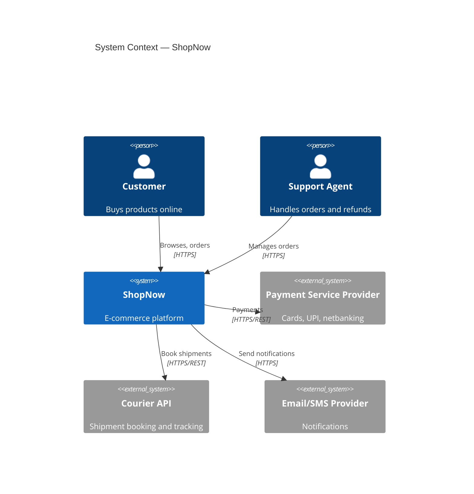
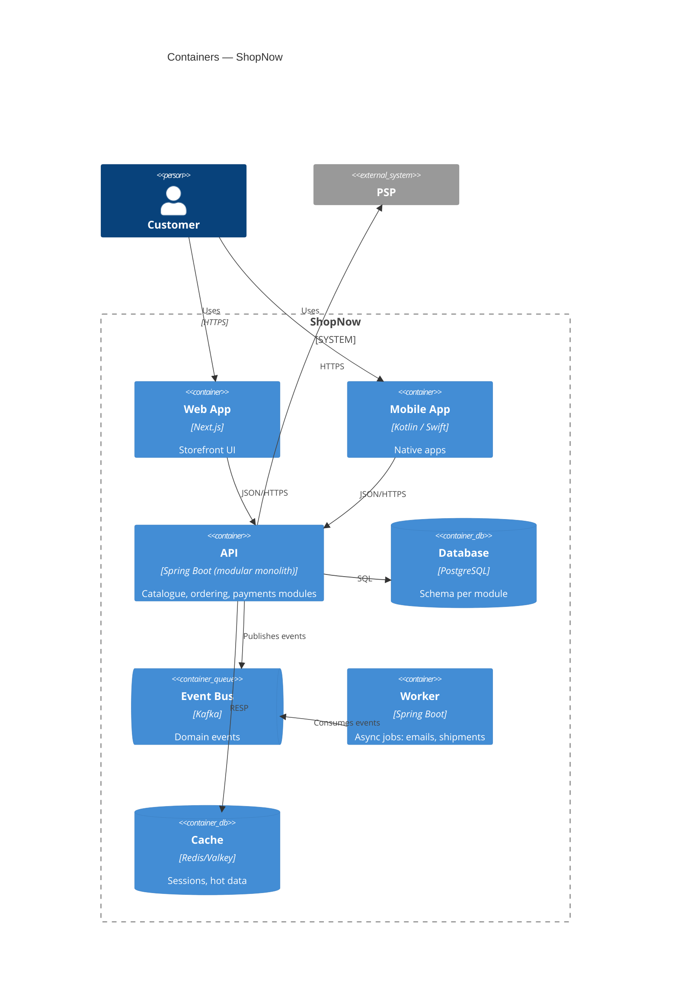

# 🏛️ Software Architecture — Production Engineering Guide

> How to shape systems that meet their quality goals for years: what architecture is (ISO/IEC/IEEE 42010:2022), quality-attribute-driven design, architectural styles and when to use them, the C4 model, Architecture Decision Records, arc42 documentation, data and integration architecture, cloud-native and resilience patterns, security architecture, evolutionary architecture with fitness functions, architecture evaluation (ATAM), governance, and scenario reference architectures.
>
> Related: [01 Foundations](./01-engineering-foundations.md) · [03 Requirements](./03-requirements-and-planning.md) · [05 Software Design](./05-software-design.md) · [10 Database](./10-database-engineering.md) · [11 API & Integration](./11-api-and-integration.md) · [17 Cloud](./17-cloud-and-infrastructure.md) · [20 Reliability](./20-reliability-and-disaster-recovery.md)

---

## 📚 Table of Contents

1. [What Architecture Is](#1-what-architecture-is)
2. [ISO/IEC/IEEE 42010:2022 — Describing Architecture](#2-isoiecieee-420102022--describing-architecture)
3. [The Architect's Job](#3-the-architects-job)
4. [Quality-Attribute-Driven Architecture](#4-quality-attribute-driven-architecture)
5. [Architectural Styles](#5-architectural-styles)
6. [Monolith vs Modular Monolith vs Microservices](#6-monolith-vs-modular-monolith-vs-microservices)
7. [Domain-Driven Design for Architecture](#7-domain-driven-design-for-architecture)
8. [The C4 Model](#8-the-c4-model)
9. [Architecture Decision Records (ADRs)](#9-architecture-decision-records-adrs)
10. [arc42 Documentation Template](#10-arc42-documentation-template)
11. [Data Architecture](#11-data-architecture)
12. [Integration Architecture](#12-integration-architecture)
13. [Cloud-Native Architecture](#13-cloud-native-architecture)
14. [Resilience Patterns](#14-resilience-patterns)
15. [Scalability Patterns](#15-scalability-patterns)
16. [Security Architecture](#16-security-architecture)
17. [Observability Architecture](#17-observability-architecture)
18. [Evolutionary Architecture and Fitness Functions](#18-evolutionary-architecture-and-fitness-functions)
19. [Architecture Evaluation (ATAM and Lightweight Reviews)](#19-architecture-evaluation-atam-and-lightweight-reviews)
20. [Well-Architected Frameworks](#20-well-architected-frameworks)
21. [Architecture Governance](#21-architecture-governance)
22. [Reference Architectures by Scenario](#22-reference-architectures-by-scenario)
23. [AI / LLM System Architecture](#23-ai--llm-system-architecture)
24. [Anti-Patterns](#24-anti-patterns)
25. [Checklists](#25-checklists)
26. [References](#26-references)

---

## 1. What Architecture Is

Architecture is the set of **fundamental decisions** about a system — its structure, its elements and their relationships, and the principles guiding its design and evolution — that are **expensive to change later**.

> "Architecture is about the important stuff. Whatever that is." — Ralph Johnson (via Martin Fowler)

| Architecture decisions (hard to reverse) | Design decisions (cheaper to reverse) |
|---|---|
| Monolith vs services; service boundaries | Class structure inside a module |
| Sync vs async communication | Choice of internal helper library |
| Primary datastore type and ownership | Index on a column |
| Public API style and versioning policy | Internal method signatures |
| Identity and trust model | Logging format of one component |
| Deployment topology, regions, tenancy model | Folder layout |
| Consistency model (strong vs eventual) | Retry count for one call |

### Architecture vs architecture description

- The **architecture** exists whether you write it down or not.
- The **architecture description (AD)** is the work product that expresses it — diagrams, decisions, rationale.
- An undocumented architecture is still an architecture; it is just one nobody can reason about safely.

---

## 2. ISO/IEC/IEEE 42010:2022 — Describing Architecture

**ISO/IEC/IEEE 42010:2022** (*Software, systems and enterprise — Architecture description*, 2nd edition, published November 2022) replaced the 2011 edition. It specifies requirements for the **structure and expression of an architecture description** for software, systems, enterprises, products, and more. It deliberately does **not** prescribe methods, notations, tools, or formats.

Notable 2022 changes: the subject is now called the **entity of interest (EoI)** (previously "system of interest") for alignment with ISO/IEC/IEEE 42020 (architecture processes) and 42030 (architecture evaluation).

### 2.1 Core concepts

```text
Entity of Interest ──has──► Architecture ──expressed by──► Architecture Description
                                                                │
          Stakeholders ──have──► Concerns ◄──framed by── Viewpoints
                                                                │
                                         Views ◄──governed by───┘
                                           │
                                     composed of models (model kinds)
                                           │
                                 Rationale + decisions + correspondences
```

| Concept | Meaning | Practical equivalent |
|---|---|---|
| **Stakeholder** | Person/group with an interest in the entity | Users, devs, ops, security, auditors |
| **Concern** | Matter of interest to a stakeholder | Performance, security, cost, deployability |
| **Viewpoint** | Conventions for constructing a view that frames certain concerns | "Deployment viewpoint: shows nodes, networks, regions" |
| **View** | Expression of the architecture from a viewpoint | Your actual deployment diagram |
| **Model kind** | Notation/technique used in a view | C4 container diagram, sequence diagram, ERD |
| **Rationale** | Why decisions were made | ADRs |
| **Correspondence** | Relationship between elements across views | Container X runs on node Y |
| **Architecture description framework (ADF)** | Reusable set of viewpoints and conventions | arc42, 4+1, TOGAF, C4 + ADRs |

### 2.2 Classic viewpoint sets

| Framework | Views |
|---|---|
| **Kruchten 4+1** | Logical, Development, Process, Physical + Scenarios |
| **Rozanski & Woods** | Context, Functional, Information, Concurrency, Development, Deployment, Operational (+ perspectives: security, performance, availability, evolution…) |
| **C4** | System Context, Container, Component, Code (+ deployment, dynamic) |
| **arc42** | 12 sections including building block, runtime, deployment views |

> Pragmatic minimum that satisfies most stakeholders: **C4 Context + Container + Deployment views, a few dynamic (sequence) views for critical flows, and ADRs for rationale.**

---

## 3. The Architect's Job

| Activity | Output |
|---|---|
| Understand business drivers and constraints | Architecture drivers list |
| Elicit and prioritise quality attributes | Quality attribute scenarios (chapter 03 §9) |
| Identify architecturally significant requirements (ASRs) | ASR list |
| Explore and compare options | Option analysis, spikes |
| Decide and record | ADRs |
| Communicate | C4 diagrams, arc42 doc, talks |
| Validate | Reviews, ATAM, prototypes, fitness functions |
| Guide implementation | Code reviews, templates, paved roads |
| Evolve | Tech radar, deprecation plans, re-architecture roadmaps |

### Architecturally significant requirements (ASRs)

A requirement is architecturally significant if it has a **measurable effect on the architecture**. Examples:

- "Must operate in two regions with RPO ≤ 5 min" → replication, data topology
- "Tenant data must be isolated for enterprise customers" → tenancy model
- "Third parties integrate via webhooks" → event delivery, retries, signing
- "10× traffic during festival sales" → elasticity, queueing, caching
- "Payments data must stay in India" → data residency, region selection

---

## 4. Quality-Attribute-Driven Architecture

Functional requirements rarely determine architecture; **quality attributes** do (ISO/IEC 25010:2023 — see chapter 01 §5).

### 4.1 Quality attributes → architectural tactics

| Quality attribute | Tactics |
|---|---|
| **Performance efficiency** | Caching, CDN, async processing, read replicas, denormalisation, connection pooling, batching, data locality |
| **Reliability / availability** | Redundancy (N+1, multi-AZ), health checks, failover, replication, timeouts, retries with jitter, circuit breakers, bulkheads, graceful degradation |
| **Security** | Zero-trust network, strong identity (OIDC), least privilege, encryption in transit/at rest, secrets management, input validation at boundaries, audit logging |
| **Maintainability** | Modularity, bounded contexts, clear APIs, dependency rules, automated tests, consistent conventions |
| **Flexibility / scalability** | Stateless services, horizontal scaling, partitioning/sharding, queues, autoscaling, IaC, containers |
| **Compatibility** | Versioned contracts, tolerant reader, backward-compatible schema evolution, adapters |
| **Interaction capability** | Edge rendering, offline-first clients, performance budgets, accessibility built into design systems |
| **Safety** | Fail-safe defaults, interlocks, human confirmation for hazardous actions |
| **Cost efficiency** (operational) | Right-sizing, autoscaling to zero, managed services, storage tiering, FinOps tagging |

### 4.2 Trade-off examples

| Choice | Gains | Costs |
|---|---|---|
| Microservices | Independent deploy, team autonomy, targeted scaling | Network failures, distributed data, operational complexity |
| Event-driven async | Decoupling, resilience, throughput | Eventual consistency, harder debugging |
| Strong consistency across regions | Correctness | Latency, availability during partitions |
| Aggressive caching | Speed, cost | Staleness, invalidation complexity |
| Multi-tenant shared DB | Cost, simplicity | Noisy neighbours, isolation risk |
| Serverless | No servers, scale-to-zero | Cold starts, vendor lock-in, limits |

### 4.3 Utility tree (prioritising quality scenarios)

```text
Utility
├── Performance
│   └── (H,M) Checkout p99 ≤ 400 ms at 3× normal peak
├── Availability
│   ├── (H,H) Loss of one AZ → < 1 min elevated errors, no data loss
│   └── (M,M) PSP outage → orders queued, user informed
├── Security
│   └── (H,M) Compromised service token cannot read other tenants' data
└── Modifiability
    └── (M,L) New payment method added in < 2 weeks without touching orders
(Importance to business, Difficulty to achieve): H/M/L
```

Scenarios rated (H,H) drive the architecture first.

---

## 5. Architectural Styles

| Style | Structure | Strengths | Weaknesses | Good fit |
|---|---|---|---|---|
| **Layered (n-tier)** | Presentation → application → domain → data | Familiar, simple | Layers leak; changes cut across all layers | CRUD apps, small teams |
| **Hexagonal (Ports & Adapters)** | Domain core; ports define interfaces; adapters for UI/DB/APIs | Testable core, swappable infrastructure | More indirection | Business-rule-heavy services |
| **Clean / Onion** | Concentric layers; dependencies point inward | Strong dependency rule | Can be over-engineered for CRUD | Long-lived domain systems |
| **Modular monolith** | One deployable, strictly separated modules | Simple ops, clear boundaries, easy refactor | Single scaling unit; needs discipline | Default for most new products |
| **Microservices** | Independently deployable services owning their data | Autonomy, independent scaling | Distributed-system complexity | Many teams, clear domains, mature platform |
| **Service-based** | A few coarse-grained services, often shared DB | Middle ground | Shared DB coupling | Migration step from monolith |
| **Event-driven** | Producers emit events; consumers react | Loose coupling, scalability, audit trail | Eventual consistency, tracing harder | Workflows, integrations, real-time |
| **Space-based** | In-memory data grids, processing units | Extreme elasticity | Complex, costly | Spiky high-volume (ticketing, auctions) |
| **Pipes and filters** | Chain of processing steps | Composable | Latency, error handling across steps | ETL, media processing, compilers |
| **Microkernel (plugin)** | Core + plugins | Extensibility | Plugin contract management | IDEs, product platforms |
| **Serverless / FaaS** | Functions triggered by events | Scale-to-zero, low ops | Cold starts, limits, local testing | Glue code, bursty workloads |
| **Cell-based** | Isolated replicas ("cells") of the full stack, each serving a subset of customers | Blast-radius containment | Routing and cell management | Very large multi-tenant SaaS |

### 5.1 Hexagonal architecture sketch

```text
            ┌──────────────── Adapters (driving) ────────────────┐
            │ REST controller   gRPC handler   CLI   Message consumer │
            └───────────────┬────────────────────────────────────┘
                            ▼  ports (use-case interfaces)
                ┌──────────────────────────────┐
                │        APPLICATION           │
                │   use cases / orchestration  │
                │ ┌──────────────────────────┐ │
                │ │          DOMAIN          │ │
                │ │ entities, value objects, │ │
                │ │ domain services, events  │ │
                │ └──────────────────────────┘ │
                └───────────────┬──────────────┘
                            ▼  ports (repository, gateway interfaces)
            ┌──────────────── Adapters (driven) ─────────────────┐
            │ PostgreSQL repo   PSP client   Kafka producer   S3  │
            └────────────────────────────────────────────────────┘
Dependency rule: source code dependencies point INWARD only.
```

---

## 6. Monolith vs Modular Monolith vs Microservices

### 6.1 Decision guide

```text
Start here ─► Are there ≥ 3 teams that need to deploy independently on different cadences?
               │ no                                       │ yes
               ▼                                          ▼
     Modular monolith                    Are domain boundaries well understood and stable?
     (enforce module boundaries)          │ no                         │ yes
                                          ▼                            ▼
                               Modular monolith first;      Do you have a platform for CI/CD,
                               extract later                observability, service discovery,
                                                            and on-call per service?
                                                              │ no            │ yes
                                                              ▼               ▼
                                                    Build platform first   Microservices
```

### 6.2 Comparison

| Dimension | Monolith | Modular monolith | Microservices |
|---|---|---|---|
| Deployment | One unit | One unit | Many units |
| Data | One DB, shared schema | One DB, schema per module | DB per service |
| Team scaling | Poor beyond ~2–3 teams | Good up to several teams | Best for many teams |
| Operational cost | Low | Low | High |
| Latency | In-process | In-process | Network hops |
| Consistency | ACID | ACID (within module boundaries) | Eventual across services (sagas) |
| Refactoring boundaries | Easy (but erodes) | Easy, enforced by tooling | Hard (cross-service changes) |
| Failure isolation | Low | Low–medium | High (if designed) |

### 6.3 Enforcing modular monolith boundaries

| Ecosystem | Tooling |
|---|---|
| Java / Kotlin | Spring Modulith, ArchUnit, Gradle/Maven modules, JPMS |
| .NET | Separate projects/assemblies, NetArchTest, ArchUnitNET |
| TypeScript | Nx module boundaries, dependency-cruiser, ESLint `import/no-restricted-paths` |
| Python | import-linter, packages per module |
| Go | `internal/` packages, separate modules |
| PHP | Deptrac |

```java
// ArchUnit: orders module must not access billing internals
@ArchTest
static final ArchRule ordersIndependentOfBillingInternals =
    noClasses().that().resideInAPackage("..orders..")
        .should().dependOnClassesThat().resideInAPackage("..billing.internal..");
```

### 6.4 Microservice prerequisites ("you must be this tall")

```text
🔴 Automated CI/CD per service
🔴 Centralised logging, metrics, and distributed tracing (OpenTelemetry)
🔴 Service-to-service authentication (mTLS / workload identity)
🔴 Contract testing between services
🔴 Clear ownership and on-call per service
🟠 Service catalogue (e.g. Backstage) with owners, docs, SLOs
🟠 Platform for provisioning (templates / golden paths)
```

---

## 7. Domain-Driven Design for Architecture

Strategic DDD (Eric Evans) gives architecture its boundaries.

| Concept | Meaning |
|---|---|
| **Domain** | The business problem space |
| **Subdomain** | Core (differentiator), Supporting, Generic (buy/reuse) |
| **Bounded context** | A boundary within which a model and its language are consistent |
| **Ubiquitous language** | Shared vocabulary of domain experts and code within a context |
| **Context map** | Relationships between bounded contexts |

### 7.1 Context-mapping patterns

| Pattern | Relationship |
|---|---|
| **Partnership** | Two teams succeed or fail together; coordinate closely |
| **Shared kernel** | Small shared model; changes need agreement |
| **Customer–supplier** | Upstream supplies; downstream's needs influence upstream |
| **Conformist** | Downstream adopts upstream's model as-is |
| **Anti-corruption layer (ACL)** | Downstream translates upstream model to protect its own |
| **Open host service + published language** | Upstream offers a well-documented protocol for many consumers |
| **Separate ways** | No integration |

### 7.2 Subdomain investment

| Subdomain type | Example (e-commerce) | Strategy |
|---|---|---|
| Core | Pricing & recommendations | Build in-house, best engineers, rich model |
| Supporting | Order management | Build simply |
| Generic | Identity, email, payments processing | Buy / SaaS / open source |

### 7.3 From bounded contexts to deployables

```text
Bounded contexts:   Catalogue | Ordering | Payments | Shipping | Identity
Modular monolith:   one deployable, one module per context, schema per module
Later extraction:   Payments → separate service (different compliance scope, PCI DSS)
```

Tactical DDD (aggregates, entities, value objects, domain events) is covered in chapter **05**.

---

## 8. The C4 Model

The **C4 model** (Simon Brown) describes software architecture at four zoom levels with simple, notation-independent diagrams. Official: https://c4model.com/

| Level | Diagram | Shows | Audience |
|---|---|---|---|
| 1 | **System Context** | The system, its users, and external systems | Everyone |
| 2 | **Container** | Deployable/runnable units (apps, services, databases, queues) and how they communicate | Technical stakeholders |
| 3 | **Component** | Major components inside one container | Developers of that container |
| 4 | **Code** | Classes / modules (usually generated or skipped) | Developers |
| + | Deployment, Dynamic, System Landscape | Infrastructure mapping, runtime flows, enterprise view | Ops, architects |

> "Container" in C4 means *a separately runnable/deployable thing* — not specifically a Docker container.

### 8.1 Context diagram (Mermaid C4 syntax)



### 8.2 Container diagram



### 8.3 Diagram hygiene

```text
✅ Title, legend, and date on every diagram
✅ Every box: name, technology, responsibility
✅ Every arrow: direction, purpose, protocol
✅ Diagrams as code (Mermaid, PlantUML C4, Structurizr DSL) stored in Git
❌ Unlabelled arrows, ambiguous boxes, mixed abstraction levels
```

---

## 9. Architecture Decision Records (ADRs)

An ADR captures **one** significant decision: its context, the decision, and consequences (Michael Nygard, 2011). ADRs are immutable once accepted; changes create a new ADR that **supersedes** the old one.

### 9.1 Nygard template

```markdown
# ADR-0011: Use PostgreSQL as the primary datastore for all modules

- Status: Accepted          (Proposed | Accepted | Deprecated | Superseded by ADR-00NN)
- Date: 2026-10-02
- Deciders: @tech-lead, @dba, @security
- Consulted: payments team, SRE

## Context
We need a transactional store for orders, payments, and catalogue. Team expertise is
strongest in PostgreSQL. Requirements: ACID for orders/payments, JSON support for
catalogue attributes, managed offering in our cloud region (data residency: India),
PITR with RPO ≤ 5 min.

## Decision
Use PostgreSQL (managed service) with one schema per module. Cross-module access only
through module APIs, never direct table access.

## Consequences
+ ACID transactions within a module; mature tooling; JSONB for flexible attributes
+ One operational datastore to run and back up
− Single DB is a shared scaling unit; we will monitor and revisit at 70% sustained CPU
− Extracting a module later requires data migration (mitigated by schema-per-module)

## Alternatives considered
- MySQL: viable; less team experience with JSON features
- MongoDB for catalogue + PostgreSQL for orders: two datastores to operate; rejected for now
```

### 9.2 MADR (Markdown Any Decision Records)

MADR adds **decision drivers**, **considered options**, and **pros/cons per option** — useful for contested decisions. https://adr.github.io/madr/

### 9.3 ADR practice

```text
docs/adr/
├── 0001-record-architecture-decisions.md
├── 0002-modular-monolith.md
├── 0011-postgresql-primary-datastore.md
└── 0014-kafka-for-domain-events.md
```

| Rule | Status |
|---|:---:|
| One decision per ADR; numbered sequentially; never renumbered | 🔴 |
| Stored in the repo next to the code it governs | 🔴 |
| Reviewed via pull request like code | 🔴 |
| Write ADRs for one-way-door decisions (datastore, public API style, tenancy, identity, cloud provider) | 🔴 |
| Link ADRs from code comments and docs where relevant | 🟠 |
| Index ADRs in the service catalogue / docs site | 🟠 |
| Tooling: `adr-tools`, Log4brains, or plain Markdown | 🟡 |

---

## 10. arc42 Documentation Template

**arc42** (Gernot Starke, Peter Hruschka) is a free, pragmatic template for architecture documentation. https://arc42.org/

| # | Section | Contents |
|---:|---|---|
| 1 | Introduction and Goals | Requirements overview, top quality goals, stakeholders |
| 2 | Constraints | Technical, organisational, regulatory constraints |
| 3 | Context and Scope | Business and technical context (C4 L1) |
| 4 | Solution Strategy | Key technology and decomposition decisions |
| 5 | Building Block View | Static decomposition (C4 L2/L3) |
| 6 | Runtime View | Important scenarios as sequence diagrams |
| 7 | Deployment View | Infrastructure, environments, mapping |
| 8 | Cross-cutting Concepts | Security, persistence, error handling, logging, i18n |
| 9 | Architecture Decisions | ADRs |
| 10 | Quality Requirements | Quality tree and scenarios |
| 11 | Risks and Technical Debt | Known risks, debt |
| 12 | Glossary | Domain and technical terms |

> Combine **arc42 structure + C4 diagrams + ADRs** for a complete, lightweight architecture description that maps cleanly onto ISO/IEC/IEEE 42010 concepts.

---

## 11. Data Architecture

### 11.1 Choosing a datastore

| Need | Datastore type | Examples |
|---|---|---|
| Transactions, relational integrity | Relational (OLTP) | PostgreSQL, MySQL, SQL Server, Oracle |
| Flexible documents | Document | MongoDB, Couchbase, PostgreSQL JSONB |
| Very high write throughput, wide rows | Wide-column | Cassandra, ScyllaDB, Bigtable |
| Low-latency key lookups, caching | Key-value | Redis/Valkey, DynamoDB, Memcached |
| Relationships / traversals | Graph | Neo4j, Amazon Neptune |
| Full-text search | Search engine | OpenSearch, Elasticsearch, Meilisearch |
| Metrics / time series | Time-series | Prometheus, TimescaleDB, InfluxDB |
| Analytics (OLAP) | Columnar warehouse | BigQuery, Snowflake, Redshift, ClickHouse |
| Files and blobs | Object storage | S3, GCS, Azure Blob, MinIO |
| Embeddings / similarity search | Vector | pgvector, OpenSearch k-NN, dedicated vector DBs |
| Global distributed SQL | NewSQL | CockroachDB, Spanner, YugabyteDB |

> Default: **start with PostgreSQL**. Add specialised stores only for a demonstrated need — each new datastore is a new system to operate, back up, secure, and upgrade.

### 11.2 Data ownership rules

```text
🔴 Each service/module OWNS its data; no other service writes to it.
🔴 Other services read via APIs, events, or published read models — not by sharing tables.
🟠 Shared reference data (countries, currencies) is published, not co-owned.
🟠 Analytics reads from replicated/streamed copies, not from OLTP primaries.
```

### 11.3 Consistency across services

| Pattern | Use |
|---|---|
| **Saga (orchestrated)** | A coordinator drives steps and compensations |
| **Saga (choreographed)** | Services react to each other's events |
| **Transactional outbox** | Write business data + outgoing event in one local transaction; relay publishes it |
| **Change Data Capture (CDC)** | Stream DB changes (e.g. Debezium) to other systems |
| **Idempotent consumers** | Deduplicate by message ID / idempotency key |
| **CQRS** | Separate write model from read models optimised for queries |
| **Event sourcing** | State = fold of events; full audit trail (use selectively) |

### 11.4 Analytical data architecture

| Approach | Description |
|---|---|
| Data warehouse | Central, modelled, governed analytics store |
| Data lake / lakehouse | Raw + curated data on object storage with table formats (Apache Iceberg, Delta Lake, Hudi) |
| Data mesh | Domain-owned data products with federated governance and self-serve platform |
| Streaming | Kafka / Pulsar + stream processors (Flink, Kafka Streams) for real-time |

### 11.5 Data lifecycle

Classification (public / internal / confidential / restricted) → residency → retention → backup → archival → deletion (legal erasure). Details: chapter **10**.

---

## 12. Integration Architecture

### 12.1 Communication styles

| Style | Coupling | Latency | Failure handling | Use |
|---|---|---|---|---|
| **Synchronous request/response** (REST, gRPC, GraphQL) | Temporal coupling | Low | Caller must handle timeouts/failures | Queries, user-facing commands needing immediate answers |
| **Asynchronous messaging** (queues) | Low | Variable | Retries, DLQs | Commands processed later, work distribution |
| **Event streaming / pub-sub** | Very low | Variable | Consumers replay | Domain events, integration, analytics |
| **Webhooks** | Low | Variable | Signed payloads, retries, idempotency | Notifying external partners |
| **Batch / file transfer** | Low | High | Reconciliation | Legacy, bank files, bulk exchange |

### 12.2 API style selection

| Style | Strengths | Use |
|---|---|---|
| **REST over HTTP** (OpenAPI) | Ubiquitous, cacheable, tooling | Public and partner APIs, CRUD-like resources |
| **gRPC** (Protocol Buffers) | Fast, typed, streaming | Internal service-to-service |
| **GraphQL** | Client-shaped queries, one endpoint | Aggregating data for diverse UIs (BFF) |
| **AsyncAPI-described events** | Documented async contracts | Kafka/AMQP/MQTT events |
| **WebSocket / SSE** | Server push | Real-time UI updates |

Details: chapter **11**.

### 12.3 Integration patterns

| Pattern | Purpose |
|---|---|
| **API Gateway** | Single entry: routing, auth, rate limiting, TLS termination |
| **Backend for Frontend (BFF)** | Per-client API tailored to web/mobile |
| **Anti-corruption layer** | Translate external/legacy models |
| **Strangler fig** | Incrementally replace a legacy system behind a facade |
| **Service mesh** | mTLS, retries, traffic shifting, telemetry at the platform layer (Istio, Linkerd) |
| **Message broker patterns** | Competing consumers, publish-subscribe, dead-letter queues, delayed retries |
| **Enterprise Integration Patterns** | Router, translator, aggregator, splitter (Hohpe & Woolf) |

---

## 13. Cloud-Native Architecture

### 13.1 Principles

| Principle | Practice |
|---|---|
| Stateless compute | Session/state in datastores or caches |
| Disposable instances | Fast startup, graceful shutdown on SIGTERM |
| Config in the environment | Twelve-Factor config; secrets from a secret manager |
| Declarative infrastructure | IaC (Terraform/OpenTofu, Pulumi, CloudFormation, Bicep) |
| Immutable deployments | New image per release; no in-place patching |
| Managed services first | Use managed DBs, queues, identity where it fits |
| Automation everywhere | CI/CD, autoscaling, self-healing |
| Observability built in | OpenTelemetry from day one |

### 13.2 The Twelve-Factor App (summary)

| # | Factor | One-line |
|---:|---|---|
| I | Codebase | One codebase in version control, many deploys |
| II | Dependencies | Explicitly declare and isolate |
| III | Config | Store config in the environment |
| IV | Backing services | Treat as attached resources |
| V | Build, release, run | Strictly separate stages |
| VI | Processes | Stateless, share-nothing processes |
| VII | Port binding | Export services via port binding |
| VIII | Concurrency | Scale out via the process model |
| IX | Disposability | Fast startup, graceful shutdown |
| X | Dev/prod parity | Keep environments similar |
| XI | Logs | Treat logs as event streams |
| XII | Admin processes | Run one-off admin tasks as processes |

Source: https://12factor.net/

### 13.3 Compute model selection

| Model | Choose when |
|---|---|
| VPS / VMs | Small scale, full control, predictable load (see **39-vps-enterprise-setup-guide.md**) |
| Managed containers (Cloud Run, App Runner, Azure Container Apps, ECS Fargate) | Most web services without needing Kubernetes control |
| Kubernetes (EKS, GKE, AKS, self-managed) | Many services, platform team, portability needs |
| Serverless functions | Event glue, bursty, low-traffic endpoints |
| Edge functions | Latency-sensitive personalisation, auth at edge |

### 13.4 Multi-tenancy models

| Model | Isolation | Cost | Use |
|---|---|---|---|
| Shared everything (tenant_id column) | Low (logical) | Lowest | SMB SaaS |
| Schema per tenant | Medium | Medium | Mid-market |
| Database per tenant | High | Higher | Enterprise, regulated |
| Stack/cell per tenant (or tenant group) | Highest | Highest | Large enterprise, residency requirements |

```text
🔴 Tenant context derived from authenticated identity, never from client input alone
🔴 Every query scoped by tenant (row-level security or enforced repository layer)
🟠 Per-tenant rate limits and quotas to prevent noisy neighbours
```

---

## 14. Resilience Patterns

| Pattern | Problem solved | Notes |
|---|---|---|
| **Timeout** | Hanging calls exhaust resources | Every remote call; propagate deadlines |
| **Retry with exponential backoff + jitter** | Transient failures | Only idempotent ops; cap attempts; retry budgets |
| **Circuit breaker** | Calling a failing dependency repeatedly | Closed → open → half-open |
| **Bulkhead** | One dependency exhausts shared pools | Separate pools/queues per dependency |
| **Rate limiting / throttling** | Overload, abuse | Token bucket at gateway and service |
| **Load shedding** | Saturation | Reject low-priority work early with 503/429 |
| **Fallback / graceful degradation** | Dependency down | Cached data, default response, reduced features |
| **Queue-based load leveling** | Spiky load | Buffer writes; workers process at sustainable rate |
| **Idempotency keys** | Duplicate requests on retry | Store key → result for a TTL |
| **Health checks** | Routing to unhealthy instances | Liveness vs readiness vs startup probes |
| **Redundancy & failover** | Node/AZ/region loss | N+1, multi-AZ by default, multi-region for critical |
| **Cell / shard isolation** | Large blast radius | Partition customers into independent cells |
| **Static stability** | Dependence on control plane during failure | Pre-provisioned capacity keeps working when control plane is impaired |

### Circuit breaker states

```text
CLOSED ──(failures ≥ threshold)──► OPEN ──(cool-down elapsed)──► HALF-OPEN
   ▲                                                               │
   └────────────(trial requests succeed)───────────────────────────┘
                (trial request fails) ──► OPEN
```

Libraries: Resilience4j (JVM), Polly (.NET), `opossum` (Node.js), `tenacity` (Python retries), `failsafe-go`, service-mesh policies.

---

## 15. Scalability Patterns

| Dimension | Pattern |
|---|---|
| **X-axis (clone)** | Run N identical stateless instances behind a load balancer |
| **Y-axis (split by function)** | Separate services/modules by capability |
| **Z-axis (split by data)** | Shard/partition by customer, region, or key |

(Scale Cube — Abbott & Fisher, *The Art of Scalability*.)

| Technique | Use |
|---|---|
| Caching (client, CDN, edge, app, DB) | Read-heavy workloads |
| Read replicas | Read scaling for relational DBs |
| Partitioning / sharding | Write scaling, data volume |
| Asynchronous processing | Smooth spikes, offload slow work |
| CQRS read models | Query-optimised views |
| Autoscaling (HPA, KEDA, cloud autoscaling) | Elastic load |
| Connection pooling (PgBouncer) | DB connection limits |
| Content delivery networks | Static assets, global latency |

### Back-of-the-envelope capacity estimate

```text
Daily active users:          2 000 000
Requests per user per day:   40
Average RPS:                 2e6 × 40 / 86 400 ≈ 926 RPS
Peak factor (festival sale): × 5 → ≈ 4 600 RPS
Per instance capacity:       ~400 RPS at target p99 (measured by load test)
Instances needed:            4 600 / 400 ≈ 12 → +N+2 headroom → 14
Storage: 300 000 orders/day × 4 KB ≈ 1.2 GB/day ≈ 440 GB/year (+ indexes ×2)
```

Always validate estimates with load tests (**40-autocannon_production_CLI.md**, chapter 19).

---

## 16. Security Architecture

| Layer | Controls |
|---|---|
| **Identity** | OIDC/OAuth 2.x for users; workload identity / mTLS for services; MFA; SSO |
| **Network** | Zero trust (NIST SP 800-207); private subnets; security groups; WAF; DDoS protection |
| **Application** | Input validation, output encoding, authorisation checks per request, secure defaults |
| **Data** | Encryption at rest (KMS), TLS 1.2+ (prefer 1.3) in transit, tokenisation, field-level encryption for sensitive data |
| **Secrets** | Vault / cloud secret manager; rotation; no secrets in images or repos |
| **Supply chain** | SBOM, signed artifacts (Sigstore/cosign), SLSA provenance, dependency scanning |
| **Detection** | Audit logs, SIEM, anomaly alerts |
| **Recovery** | Immutable backups, incident response runbooks |

### Threat modelling (STRIDE) at architecture time

| Threat | Property violated | Example mitigation |
|---|---|---|
| **S**poofing | Authenticity | Strong auth, mTLS |
| **T**ampering | Integrity | Signing, checksums, DB permissions |
| **R**epudiation | Non-repudiation | Audit logs with tamper evidence |
| **I**nformation disclosure | Confidentiality | Encryption, least privilege, data minimisation |
| **D**enial of service | Availability | Rate limiting, autoscaling, quotas |
| **E**levation of privilege | Authorisation | RBAC/ABAC, sandboxing, least privilege |

Draw trust boundaries on the C4 container diagram and apply STRIDE per data flow that crosses one. Full guidance: chapter **09**.

---

## 17. Observability Architecture

```text
Applications ──(OpenTelemetry SDK / auto-instrumentation)──► OTel Collector
                                                              │
               ┌───────────────┬───────────────┬─────────────┘
               ▼               ▼               ▼
            Metrics          Logs           Traces
         (Prometheus,     (Loki, Elastic,  (Tempo, Jaeger,
          Mimir, cloud)    cloud logging)   cloud tracing)
               └───────────────┴───────────────┘
                               ▼
                    Dashboards & alerts (Grafana, cloud consoles)
                    SLOs, error budgets, on-call routing
```

Architectural requirements:

- W3C Trace Context (`traceparent`) propagated across HTTP, gRPC, and messaging.
- Correlation ID in every log line.
- RED metrics (Rate, Errors, Duration) per service; USE metrics (Utilisation, Saturation, Errors) per resource.
- SLOs defined per user journey.

Details: chapter **18**. Single-server stack example: **39-vps-enterprise-setup-guide.md**.

---

## 18. Evolutionary Architecture and Fitness Functions

Architectures must change. **Evolutionary architecture** (Ford, Parsons, Kua, Sadalage) supports guided, incremental change across multiple dimensions, protected by **fitness functions** — automated checks that an architectural characteristic still holds.

| Characteristic | Fitness function example | Where it runs |
|---|---|---|
| Modularity | ArchUnit / dependency-cruiser rules: no forbidden dependencies | CI on every PR |
| Performance | p95 latency of key endpoints ≤ budget in load test | Nightly / pre-release |
| Security | No critical CVEs in dependencies; no secrets in repo | CI |
| API compatibility | OpenAPI diff shows no breaking changes | CI |
| Schema evolution | Migrations are backward compatible (expand/contract linter) | CI |
| Availability | SLO burn rate below threshold | Production monitoring |
| Cost | Cost per 1 000 requests within budget | Weekly report |
| Resilience | Chaos experiment: kill one instance → no user-visible errors | Scheduled in staging/prod |

```yaml
# Example: fail the build if a breaking OpenAPI change is introduced
- name: Check API compatibility
  run: |
    npx @openapitools/openapi-diff ./api/openapi-main.yaml ./api/openapi.yaml --fail-on-incompatible
```

> Tool names and flags vary by version; pin and verify the tool you choose in your pipeline.

### Technology radar

Track technologies in four rings — **Adopt, Trial, Assess, Hold** (Thoughtworks Technology Radar format) — to make technology choices explicit and reviewable. https://www.thoughtworks.com/radar

---

## 19. Architecture Evaluation (ATAM and Lightweight Reviews)

### 19.1 ATAM (Architecture Tradeoff Analysis Method, SEI)

| Phase | Activities |
|---|---|
| 0 Partnership & preparation | Scope, stakeholders, logistics |
| 1 Evaluation (architects + evaluators) | Present business drivers and architecture; identify approaches; build utility tree; analyse approaches |
| 2 Evaluation (all stakeholders) | Brainstorm and prioritise scenarios; analyse again; present results |
| 3 Follow-up | Report: risks, non-risks, sensitivity points, trade-off points |

Outputs: **risks**, **non-risks**, **sensitivity points** (a parameter strongly affects a quality attribute), **trade-off points** (a parameter affects several attributes in opposing ways), risk themes.

ISO/IEC/IEEE **42030** (architecture evaluation framework) provides the standardised framing for evaluations.

### 19.2 Lightweight architecture review (for most teams)

```markdown
## Architecture Review — <system/change>
1. Context: problem, drivers, constraints (5 min)
2. Quality goals: top 3–5 scenarios with measures
3. Proposed architecture: C4 L1/L2, key flows, deployment
4. Decisions: ADRs (proposed/accepted), options rejected
5. Risks: what could make this fail? (reliability, security, cost, team skills)
6. Operability: deployment, rollback, observability, on-call, DR
7. Security: trust boundaries, threat model summary, data classification
8. Cost: rough monthly cost at expected and peak load
9. Migration: from current state; reversibility
10. Outcome: approve / approve with actions / revise
```

### 19.3 When a review is required

| Change | Review |
|---|---|
| New service / new datastore / new external vendor | 🔴 Required |
| New public API or breaking change | 🔴 Required |
| Change to auth, tenancy, or data residency | 🔴 Required + security |
| Major framework/runtime migration | 🟠 Recommended |
| Internal refactor within a module | 🟡 Team-level ADR only |

---

## 20. Well-Architected Frameworks

Cloud providers publish architecture frameworks with pillars and review tools. Use them as checklists even if you are multi-cloud or on a VPS.

| Framework | Pillars |
|---|---|
| **AWS Well-Architected** | Operational Excellence, Security, Reliability, Performance Efficiency, Cost Optimization, Sustainability |
| **Azure Well-Architected** | Reliability, Security, Cost Optimization, Operational Excellence, Performance Efficiency |
| **Google Cloud Architecture Framework** | Operational excellence, security/privacy/compliance, reliability, cost optimization, performance optimization (+ system design guidance) |

- AWS: https://aws.amazon.com/architecture/well-architected/
- Azure: https://learn.microsoft.com/azure/well-architected/
- Google Cloud: https://cloud.google.com/architecture/framework

Detailed cloud guidance: chapter **17**.

---

## 21. Architecture Governance

Good governance is **enabling, lightweight, and automated** — paved roads, not toll gates.

| Mechanism | Purpose |
|---|---|
| **Architecture principles** | Short list guiding all decisions (below) |
| **ADRs** | Decisions with rationale |
| **Architecture review / design forum** | Peer review for significant changes (§19.3) |
| **Golden paths / templates** | Pre-approved service templates with CI, observability, security built in |
| **Fitness functions** | Automated enforcement (§18) |
| **Tech radar** | Approved, trial, and deprecated technologies |
| **Service catalogue** | Ownership, dependencies, docs, SLOs (e.g. Backstage) |
| **Deprecation policy** | How long old APIs/libraries are supported |

### Example architecture principles

```markdown
1. Prefer a modular monolith until independent deployment is a proven need.
2. Each module/service owns its data; no shared tables.
3. Every interface is versioned and documented (OpenAPI / AsyncAPI / proto).
4. Every external call has a timeout; retries are safe and jittered.
5. Security by default: zero trust, least privilege, encryption everywhere.
6. Observability is part of done: logs, metrics, traces, SLOs.
7. Infrastructure is code; environments are reproducible.
8. Prefer managed services for generic subdomains.
9. Data residency and privacy requirements are architectural constraints, not afterthoughts.
10. Decisions that are hard to reverse require an ADR and review.
```

---

## 22. Reference Architectures by Scenario

### 22.1 Startup SaaS (single region)

```text
CDN/WAF → Load balancer → Modular monolith (2–3 stateless instances, containers)
         → PostgreSQL (managed, multi-AZ, PITR) + Redis/Valkey
         → Object storage for files
         → Background worker + queue
Observability: OTel → managed metrics/logs/traces; error tracking
Auth: managed identity provider (OIDC)
```

Single-server variant for very early stage: **39-vps-enterprise-setup-guide.md**.

### 22.2 Enterprise B2B SaaS (multi-tenant, regulated)

```text
Edge: CDN + WAF + API gateway (per-tenant rate limits)
Identity: SSO (SAML/OIDC) per tenant, SCIM provisioning
Compute: Kubernetes, services per bounded context, service mesh (mTLS)
Data: DB per service; tenant isolation by schema or DB for enterprise tier
Events: Kafka with schema registry; outbox pattern
Compliance: audit log service, data residency via regional cells
DR: warm standby region; quarterly failover drills
```

### 22.3 High-traffic e-commerce (sale spikes)

```text
Static + edge-rendered storefront on CDN
Catalogue/search read path: cache + search engine (OpenSearch)
Cart/checkout: separate scaling, queue-based order intake
Inventory reservation: strongly consistent store with idempotent operations
Payments: isolated service (PCI DSS scope reduction via PSP tokenisation)
Load tests at 5–10× normal peak before each sale
```

### 22.4 Mobile-first consumer app

```text
Native apps (offline-first local DB) ↔ BFF (GraphQL or REST)
Push notifications service; remote config & feature flags (kill switches)
Media upload direct-to-object-storage with pre-signed URLs
Analytics events pipeline → warehouse
```

### 22.5 Data / event platform

```text
Producers → Kafka (schema registry, Avro/Protobuf) → stream processing (Flink/Kafka Streams)
→ lakehouse (Iceberg/Delta on object storage) → warehouse/BI
Governance: data catalogue, lineage, data contracts, PII tagging
```

### 22.6 Legacy modernisation

```text
Facade/API gateway in front of legacy
Strangler fig: new services take over routes one capability at a time
CDC from legacy DB to new stores for read models
Anti-corruption layer between new domain model and legacy model
Decommission legacy pieces as traffic reaches zero
```

---

## 23. AI / LLM System Architecture

```text
Client → API / BFF → AI orchestration service
                      ├── Prompt templates (versioned)
                      ├── Retrieval (RAG): embeddings + vector index + permission filtering
                      ├── Tools / function calling (allow-listed, scoped credentials)
                      ├── Guardrails: input/output filters, PII redaction, schema validation
                      ├── Model gateway: provider routing, retries, timeouts, caching, cost tracking
                      └── Evaluation & telemetry: traces of prompts/responses (with redaction), feedback
```

| Concern | Architectural decision |
|---|---|
| Provider dependency | Model gateway abstraction; fallback provider/model; timeouts |
| Data protection | Redact PII before external calls; approved providers per data class; residency |
| Prompt injection | Treat retrieved/user content as untrusted; no side-effecting tool calls without authorisation and confirmation |
| Authorisation in RAG | Filter documents by the requesting user's permissions **before** retrieval results reach the model |
| Cost | Token budgets, caching, smaller models for simple tasks, per-tenant quotas |
| Quality | Offline eval suites in CI; online feedback; versioned prompts and models |
| Latency | Streaming responses; async for long tasks |
| Auditability | Log model version, prompt version, retrieved document IDs, tool calls |

References: NIST AI RMF; OWASP Top 10 for LLM Applications (https://genai.owasp.org/).

---

## 24. Anti-Patterns

| Anti-pattern | Symptom | Remedy |
|---|---|---|
| **Big ball of mud** | No discernible structure | Introduce modules and dependency rules incrementally |
| **Distributed monolith** | Services must deploy together; chatty sync calls | Re-draw boundaries around domains; async events; merge services |
| **Shared database integration** | Many services write the same tables | Data ownership; APIs/events; CDC read models |
| **Resume-driven architecture** | Kubernetes + microservices + 4 datastores for 2 engineers | Choose boring technology; ADRs with alternatives |
| **Ivory-tower architecture** | Diagrams disconnected from code | Architects code and review; fitness functions |
| **Golden hammer** | One technology for every problem | Option analysis per ASR |
| **Missing non-functionals** | Works in demo, fails at scale | Quality attribute scenarios up front |
| **Synchronous chains** | A → B → C → D; latency and failures multiply | Async, caching, aggregate data locally |
| **No ownership** | Orphaned services | Service catalogue with owners |
| **Architecture by vendor brochure** | Lock-in without exit plan | Exit strategy in ADR; abstraction at the right boundaries |

---

## 25. Checklists

### New system architecture
- [ ] Business drivers, constraints, and stakeholders documented
- [ ] Top quality attributes ranked with measurable scenarios (utility tree)
- [ ] Architecturally significant requirements identified
- [ ] C4 Context + Container + Deployment diagrams (as code)
- [ ] Key decisions recorded as ADRs with alternatives
- [ ] Data ownership, consistency model, and residency defined
- [ ] Integration styles and API/event contracts chosen
- [ ] Threat model with trust boundaries
- [ ] Observability design (OTel, SLOs)
- [ ] Resilience patterns for every external dependency
- [ ] Capacity estimate validated by load test plan
- [ ] Cost estimate at expected and peak load
- [ ] DR objectives (RPO/RTO) and strategy
- [ ] Fitness functions automated in CI
- [ ] Architecture review completed

### Before splitting into microservices
- [ ] Bounded contexts validated with domain experts
- [ ] Independent deployment need demonstrated
- [ ] CI/CD, tracing, service auth, and contract tests in place
- [ ] Owner and on-call identified per service
- [ ] Data migration and consistency strategy (outbox/saga) designed

---

## 26. References

### Standards
- ISO/IEC/IEEE 42010:2022 Architecture description: https://www.iso.org/standard/74393.html
- ISO/IEC/IEEE 42020 (architecture processes) & 42030 (architecture evaluation): https://www.iso.org
- ISO/IEC 25010:2023 quality model: https://www.iso.org/standard/78176.html
- SWEBOK v4.0 — Software Architecture KA: https://www.computer.org/education/bodies-of-knowledge/software-engineering

### Methods and documentation
- C4 model: https://c4model.com/
- arc42: https://arc42.org/
- ADRs: https://adr.github.io/ · MADR: https://adr.github.io/madr/
- Michael Nygard — Documenting Architecture Decisions: https://cognitect.com/blog/2011/11/15/documenting-architecture-decisions
- SEI — ATAM and quality attributes: https://www.sei.cmu.edu/
- The Twelve-Factor App: https://12factor.net/
- Thoughtworks Technology Radar: https://www.thoughtworks.com/radar
- Martin Fowler — architecture articles: https://martinfowler.com/architecture/
- Enterprise Integration Patterns: https://www.enterpriseintegrationpatterns.com/
- Mermaid C4 diagrams: https://mermaid.js.org/syntax/c4.html
- Structurizr: https://structurizr.com/

### Cloud frameworks
- AWS Well-Architected: https://aws.amazon.com/architecture/well-architected/
- Azure Well-Architected: https://learn.microsoft.com/azure/well-architected/
- Google Cloud Architecture Framework: https://cloud.google.com/architecture/framework

### Security and AI
- NIST SP 800-207 Zero Trust: https://csrc.nist.gov/pubs/sp/800/207/final
- OWASP Gen AI Security Project (Top 10 for LLM Apps): https://genai.owasp.org/
- NIST AI RMF: https://www.nist.gov/itl/ai-risk-management-framework

### Books
- *Fundamentals of Software Architecture* — Richards & Ford
- *Software Architecture in Practice* — Bass, Clements, Kazman (SEI)
- *Building Evolutionary Architectures* — Ford, Parsons, Kua, Sadalage
- *Domain-Driven Design* — Eric Evans
- *Designing Data-Intensive Applications* — Martin Kleppmann

---

**Previous:** [03 — Requirements & Planning](./03-requirements-and-planning.md) · **Next:** [05 — Software Design](./05-software-design.md)