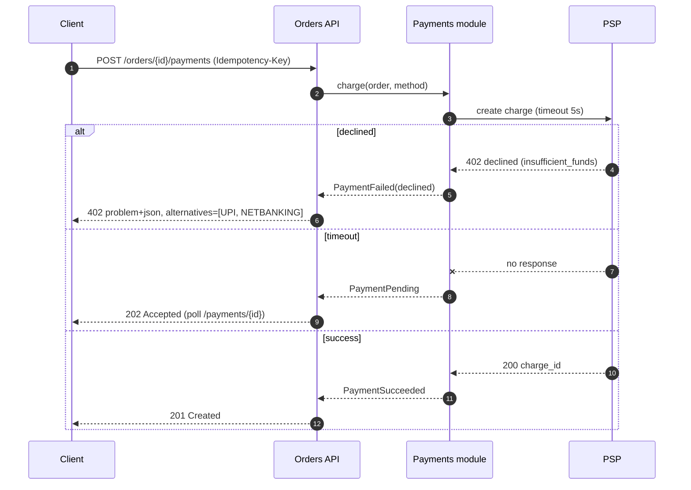
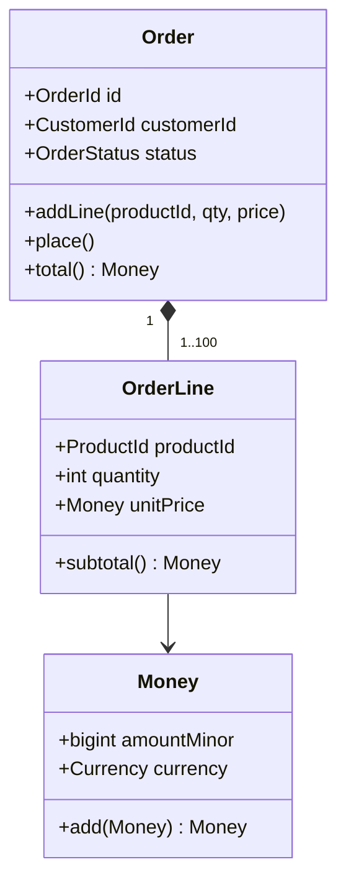

# 🧩 Software Design — Production Engineering Guide

> Turning architecture into well-structured, testable, changeable code: design levels, the design-doc/RFC process, tactical Domain-Driven Design, the essential design patterns (GoF and enterprise) with when *not* to use them, error-handling design, interface and contract design, state machines, dependency injection, designing for testability, concurrency, caching, idempotency, configuration, UI and accessibility design, code smells and refactoring, UML/diagrams, and design review checklists.
>
> Related: [01 Foundations §12 Design Principles](./01-engineering-foundations.md#12-design-principles) · [04 Architecture](./04-software-architecture.md) · [06 Coding Standards](./06-coding-standards.md) · [08 Testing](./08-testing-and-quality.md) · [10 Database](./10-database-engineering.md) · [11 API](./11-api-and-integration.md)

---

## 📚 Table of Contents

1. [Design vs Architecture](#1-design-vs-architecture)
2. [Design Levels](#2-design-levels)
3. [The Design Process and Design Docs (RFCs)](#3-the-design-process-and-design-docs-rfcs)
4. [Modularity, Cohesion, and Coupling](#4-modularity-cohesion-and-coupling)
5. [Tactical Domain-Driven Design](#5-tactical-domain-driven-design)
6. [Design Patterns — Creational](#6-design-patterns--creational)
7. [Design Patterns — Structural](#7-design-patterns--structural)
8. [Design Patterns — Behavioural](#8-design-patterns--behavioural)
9. [Enterprise Application Patterns](#9-enterprise-application-patterns)
10. [Dependency Injection and Composition Roots](#10-dependency-injection-and-composition-roots)
11. [Interface and Contract Design](#11-interface-and-contract-design)
12. [Error-Handling Design](#12-error-handling-design)
13. [State Machines](#13-state-machines)
14. [Designing for Testability](#14-designing-for-testability)
15. [Concurrency Design](#15-concurrency-design)
16. [Idempotency Design](#16-idempotency-design)
17. [Caching Design](#17-caching-design)
18. [Configuration and Feature Flag Design](#18-configuration-and-feature-flag-design)
19. [Logging and Telemetry Design](#19-logging-and-telemetry-design)
20. [Security by Design](#20-security-by-design)
21. [UI, UX, and Accessibility Design](#21-ui-ux-and-accessibility-design)
22. [Code Smells and Refactoring](#22-code-smells-and-refactoring)
23. [Diagrams and UML Quick Reference](#23-diagrams-and-uml-quick-reference)
24. [Design Review Checklist](#24-design-review-checklist)
25. [References](#25-references)

---

## 1. Design vs Architecture

| | Architecture (chapter 04) | Design (this chapter) |
|---|---|---|
| Scope | System-wide structure | Inside a service / module / component |
| Cost of change | High | Lower |
| Driven by | Quality attributes, organisation | Domain rules, readability, testability |
| Artifacts | C4 L1–L2, ADRs, deployment views | C4 L3, class/sequence diagrams, design docs, interfaces |
| Owners | Architects, tech leads | Every engineer |

The boundary is fuzzy on purpose: design decisions that turn out to be expensive to reverse **become architecture** — record them as ADRs.

---

## 2. Design Levels

| Level | Questions | Techniques |
|---|---|---|
| **Module / package** | What are the units, and what may depend on what? | Bounded contexts, layering, dependency rules |
| **Component / class** | What responsibilities, what collaborators? | SOLID, CRC cards, patterns |
| **Function** | What does it take, return, and guarantee? | Pure functions, small functions, clear names |
| **Data** | What shape, invariants, lifecycle? | Value objects, schemas, state machines |
| **Interface** | What contract do others rely on? | Types, OpenAPI/proto, versioning |
| **Interaction** | Who calls whom, in what order, with what failure modes? | Sequence diagrams, error design |

---

## 3. The Design Process and Design Docs (RFCs)

### 3.1 When to write a design doc

| Change | Design doc? |
|---|---|
| New service, module, or major feature (> ~1–2 weeks of work) | 🔴 Yes |
| Change to a public API, data model, or cross-team contract | 🔴 Yes |
| Security- or privacy-sensitive change | 🔴 Yes |
| Significant refactor or migration | 🟠 Yes |
| Bug fix or small feature in one module | 🟡 PR description is enough |

### 3.2 Design doc template

```markdown
# Design: <title>
Author(s): · Reviewers: · Status: Draft | In review | Approved | Implemented | Abandoned
Created: 2026-10-02 · Last updated: · Tracking issue: PAY-42

## 1. Context and problem
What problem? Who is affected? Link PRD / requirements (REQ-IDs).

## 2. Goals and non-goals
Measurable goals; explicit non-goals.

## 3. Proposed design
### 3.1 Overview (diagram: C4 component or sequence)
### 3.2 Data model and invariants
### 3.3 Interfaces / APIs (signatures, OpenAPI/proto snippets)
### 3.4 Key flows (happy path + failure paths)
### 3.5 Error handling and retries
### 3.6 Concurrency and consistency
### 3.7 Security and privacy (threats, authz, data classification)
### 3.8 Observability (logs, metrics, traces, alerts)
### 3.9 Performance and capacity
### 3.10 Rollout, migration, rollback (flags, backfills, expand/contract)

## 4. Alternatives considered
Option, pros, cons, why rejected.

## 5. Testing strategy
Unit, integration, contract, E2E, load; test data.

## 6. Risks and open questions

## 7. Effort and milestones
```

### 3.3 Review etiquette

```text
Authors:   share early (30% done) for direction, again at 90% for detail
Reviewers: separate blocking issues from suggestions ("nit:", "suggestion:", "blocking:")
Everyone:  disagree on the doc, decide in a meeting if async stalls > 2 days
Outcome:   decisions that are hard to reverse → extract into ADRs (chapter 04 §9)
```

---

## 4. Modularity, Cohesion, and Coupling

### 4.1 Cohesion (best → worst)

| Type | Description |
|---|---|
| **Functional** ✅ | Everything contributes to one well-defined task |
| Sequential | Output of one part is input to the next |
| Communicational | Parts operate on the same data |
| Procedural | Parts follow an execution order |
| Temporal | Parts run at the same time (e.g. "init") |
| Logical | Grouped by category ("utils") |
| **Coincidental** ❌ | No meaningful relationship |

### 4.2 Coupling (loosest → tightest)

| Type | Description |
|---|---|
| **Message / data** ✅ | Communicate via simple parameters or messages |
| Stamp | Pass whole structures where only parts are needed |
| Control | One module tells another how to behave (flags) |
| External | Share an external format/protocol |
| Common | Share global data |
| **Content** ❌ | One module reaches into another's internals |

### 4.3 Information hiding (Parnas)

Hide **design decisions likely to change** (data formats, algorithms, third-party APIs) behind stable interfaces. The public surface of a module should be as small as possible.

```text
module payments/
├── api/           ← public: interfaces, DTOs, events (stable)
├── internal/      ← private: implementation (free to change)
└── infra/         ← adapters: PSP clients, repositories
Rule: other modules import only payments/api.
```

### 4.4 Package by feature, not by layer

```text
❌ by layer                       ✅ by feature (with layers inside)
controllers/                      orders/
  OrderController                   OrderController
  PaymentController                 OrderService
services/                           OrderRepository
  OrderService                      Order (domain)
  PaymentService                  payments/
repositories/                       PaymentController
  ...                               PaymentService ...
```

Feature packaging keeps things that change together, together.

---

## 5. Tactical Domain-Driven Design

| Building block | Definition | Example |
|---|---|---|
| **Entity** | Has identity that persists over time | `Order(id=…)` |
| **Value object** | Defined by its attributes, immutable, self-validating | `Money(amount, currency)`, `Email`, `GSTIN` |
| **Aggregate** | Cluster of entities/value objects with one **root** that enforces invariants; the unit of consistency | `Order` root with `OrderLines` |
| **Domain event** | Something meaningful that happened | `OrderPlaced`, `PaymentDeclined` |
| **Domain service** | Domain logic that doesn't belong to one entity | `PricingService` |
| **Repository** | Collection-like access to aggregates | `OrderRepository.save(order)` |
| **Factory** | Encapsulates complex creation | `OrderFactory.fromCart(cart)` |
| **Application service** | Orchestrates use cases; no business rules | `PlaceOrderHandler` |

### 5.1 Aggregate design rules (Vaughn Vernon)

1. Protect **true invariants** inside aggregate boundaries.
2. Design **small aggregates**.
3. Reference other aggregates **by identity** only.
4. Use **eventual consistency** between aggregates (domain events).

### 5.2 Value object example (TypeScript)

```typescript
export class Money {
  private constructor(
    readonly amountMinor: bigint,     // paise / cents — never floats
    readonly currency: 'INR' | 'USD' | 'EUR',
  ) {}

  static of(amountMinor: bigint, currency: Money['currency']): Money {
    if (amountMinor < 0n) throw new RangeError('Money cannot be negative');
    return new Money(amountMinor, currency);
  }

  add(other: Money): Money {
    if (other.currency !== this.currency) throw new Error('Currency mismatch');
    return new Money(this.amountMinor + other.amountMinor, this.currency);
  }

  equals(other: Money): boolean {
    return this.amountMinor === other.amountMinor && this.currency === other.currency;
  }
}
```

### 5.3 Aggregate root example (Java)

```java
public final class Order {
    private final OrderId id;
    private final CustomerId customerId;          // reference by ID only
    private final List<OrderLine> lines = new ArrayList<>();
    private OrderStatus status = OrderStatus.DRAFT;
    private final List<DomainEvent> events = new ArrayList<>();

    public void addLine(ProductId productId, int quantity, Money unitPrice) {
        requireStatus(OrderStatus.DRAFT);
        if (quantity <= 0) throw new IllegalArgumentException("quantity must be > 0");
        if (lines.size() >= 100) throw new DomainException("max 100 lines per order");
        lines.add(new OrderLine(productId, quantity, unitPrice));
    }

    public void place() {
        requireStatus(OrderStatus.DRAFT);
        if (lines.isEmpty()) throw new DomainException("cannot place empty order");
        status = OrderStatus.PLACED;
        events.add(new OrderPlaced(id, customerId, total(), Instant.now()));
    }

    public Money total() {
        return lines.stream().map(OrderLine::subtotal).reduce(Money.zero(Currency.INR), Money::add);
    }

    private void requireStatus(OrderStatus expected) {
        if (status != expected) throw new DomainException("expected " + expected + " but was " + status);
    }

    public List<DomainEvent> pullEvents() { var e = List.copyOf(events); events.clear(); return e; }
}
```

### 5.4 Anaemic vs rich domain model

| Anaemic | Rich |
|---|---|
| Entities are data bags with getters/setters | Entities enforce their own invariants |
| Rules scattered across services | Rules live with the data they protect |
| Easy for CRUD | Better for complex business rules |

> Use rich models in **core subdomains**; simple CRUD/transaction scripts are fine in **supporting/generic** subdomains.

---

## 6. Design Patterns — Creational

From *Design Patterns* (Gamma, Helm, Johnson, Vlissides — "Gang of Four", 1994). Patterns are vocabulary, not goals.

| Pattern | Intent | Use when | Avoid when |
|---|---|---|---|
| **Factory Method** | Subclasses decide which class to instantiate | Creation varies by context | A simple constructor suffices |
| **Abstract Factory** | Create families of related objects | Swap whole families (e.g. per cloud provider) | Only one family exists |
| **Builder** | Construct complex objects step by step | Many optional parameters; immutable result | Few parameters (use named args/records) |
| **Prototype** | Clone existing instances | Expensive creation, many similar objects | Deep-copy semantics are unclear |
| **Singleton** | One instance globally | Truly single resources — prefer DI-managed single instance instead | Almost always: hidden global state hurts testing |

### Builder (Kotlin — often replaced by named/default args)

```kotlin
data class HttpClientConfig(
    val baseUrl: String,
    val connectTimeout: Duration = 2.seconds,
    val readTimeout: Duration = 5.seconds,
    val maxRetries: Int = 3,
    val userAgent: String = "shopnow/1.0",
)
val config = HttpClientConfig(baseUrl = "https://api.psp.example", maxRetries = 2)
```

---

## 7. Design Patterns — Structural

| Pattern | Intent | Production example |
|---|---|---|
| **Adapter** | Convert one interface into another | Wrap a PSP SDK behind your `PaymentGateway` port |
| **Facade** | Simple interface to a complex subsystem | `CheckoutFacade` hiding cart, pricing, payment calls |
| **Decorator** | Add behaviour without changing the class | Add retries, caching, metrics around a client |
| **Proxy** | Control access to an object | Lazy loading, remote proxies, access checks |
| **Composite** | Treat trees uniformly | UI component trees, permission groups |
| **Bridge** | Separate abstraction from implementation | Notification abstraction × channels (email/SMS/push) |
| **Flyweight** | Share fine-grained objects | Glyph/icon caches, interned strings |

### Decorator for cross-cutting concerns (Go)

```go
type PaymentGateway interface {
    Charge(ctx context.Context, req ChargeRequest) (ChargeResult, error)
}

type metricsGateway struct {
    next    PaymentGateway
    latency *prometheus.HistogramVec
}

func (m metricsGateway) Charge(ctx context.Context, req ChargeRequest) (ChargeResult, error) {
    start := time.Now()
    res, err := m.next.Charge(ctx, req)
    status := "ok"
    if err != nil {
        status = "error"
    }
    m.latency.WithLabelValues(status).Observe(time.Since(start).Seconds())
    return res, err
}

// Composition root:
// gw := metricsGateway{next: retryGateway{next: pspAdapter{...}}, latency: h}
```

---

## 8. Design Patterns — Behavioural

| Pattern | Intent | Production example |
|---|---|---|
| **Strategy** | Interchangeable algorithms | Pricing rules, tax calculation per region, retry policies |
| **Observer / pub-sub** | Notify dependents of changes | Domain events, UI state updates |
| **Command** | Encapsulate a request as an object | Job queues, undo/redo, CQRS commands |
| **Template Method** | Skeleton algorithm with overridable steps | Import pipelines (prefer composition/strategy in modern code) |
| **Chain of Responsibility** | Pass request along handlers | HTTP middleware, validation chains |
| **State** | Behaviour changes with internal state | Order lifecycle (see §13) |
| **Iterator** | Sequential access without exposing structure | Streams, paginated API clients |
| **Mediator** | Centralise complex communication | UI form coordination, in-process command buses |
| **Visitor** | Operations over object structures | AST processing, compilers, linters |
| **Memento** | Capture/restore state | Undo, drafts |
| **Specification** | Composable business rules | Eligibility checks, query filters |

### Strategy replacing conditionals (Python)

```python
from dataclasses import dataclass
from decimal import Decimal
from typing import Protocol

class TaxPolicy(Protocol):
    def tax_for(self, amount: Decimal) -> Decimal: ...

@dataclass(frozen=True)
class GstPolicy:
    rate: Decimal  # e.g. Decimal("0.18")
    def tax_for(self, amount: Decimal) -> Decimal:
        return (amount * self.rate).quantize(Decimal("0.01"))

@dataclass(frozen=True)
class NoTaxPolicy:
    def tax_for(self, amount: Decimal) -> Decimal:
        return Decimal("0.00")

def tax_policy_for(region: str) -> TaxPolicy:
    policies: dict[str, TaxPolicy] = {"IN": GstPolicy(Decimal("0.18")), "EXPORT": NoTaxPolicy()}
    try:
        return policies[region]
    except KeyError:
        raise ValueError(f"No tax policy for region {region!r}") from None
```

> Real tax rules are product- and jurisdiction-specific; the rates here are illustrative only.

### Middleware chain (TypeScript / Express-style)

```typescript
type Handler = (req: Request) => Promise<Response>;
type Middleware = (next: Handler) => Handler;

const withRequestId: Middleware = next => async req => {
  const id = req.headers.get('x-request-id') ?? crypto.randomUUID();
  const res = await next(req);
  res.headers.set('x-request-id', id);
  return res;
};

const compose = (...mws: Middleware[]) => (h: Handler) => mws.reduceRight((acc, mw) => mw(acc), h);
```

---

## 9. Enterprise Application Patterns

From *Patterns of Enterprise Application Architecture* (Martin Fowler) and common practice.

| Pattern | Purpose | Notes |
|---|---|---|
| **Transaction Script** | One procedure per use case | Fine for simple CRUD |
| **Domain Model** | Rich objects with behaviour | Complex rules (see §5) |
| **Service Layer / Application Service** | Defines use-case boundaries; transactions | Thin; delegates rules to domain |
| **Repository** | Collection-like persistence abstraction | One per aggregate root |
| **Unit of Work** | Track changes; commit atomically | Built into ORMs (JPA EntityManager, EF Core DbContext, SQLAlchemy Session) |
| **Data Mapper** | Map objects ↔ tables independently | ORMs |
| **Active Record** | Objects persist themselves | Rails, Laravel Eloquent; simple domains |
| **DTO** | Carry data across boundaries | Never expose entities directly via APIs |
| **Mapper** | Convert between DTOs and domain | MapStruct (Java), manual mapping, AutoMapper (.NET — use judiciously) |
| **Query Object / Specification** | Encapsulate query criteria | Avoid repository method explosion |
| **CQRS** | Separate commands from queries | Use when read and write needs diverge significantly |
| **Outbox** | Reliable event publishing | See chapter 04 §11.3 |
| **Optimistic Offline Lock** | Prevent lost updates | Version column; `If-Match` / ETag in APIs |

### Layer responsibilities

| Layer | Contains | Must not contain |
|---|---|---|
| Presentation / API | Controllers, request validation (shape), DTO mapping, auth extraction | Business rules, SQL |
| Application | Use-case orchestration, transactions, authorisation decisions, events dispatch | UI concerns, framework-specific persistence details |
| Domain | Entities, value objects, domain services, invariants | Framework annotations where avoidable, I/O |
| Infrastructure | Repositories, clients, messaging, file I/O | Business rules |

---

## 10. Dependency Injection and Composition Roots

**Dependency Inversion Principle**: high-level policy depends on abstractions; details implement them. **Dependency Injection (DI)** supplies those implementations from outside.

```text
❌ class OrderService { repo = new PostgresOrderRepository() }   // hard-wired
✅ class OrderService { constructor(private repo: OrderRepository) {} }   // injected
```

| Rule | Status |
|---|:---:|
| Prefer **constructor injection**; dependencies are explicit and immutable | 🔴 |
| Wire everything in one **composition root** (main / DI container config) | 🔴 |
| Inject interfaces at architectural boundaries (I/O, clocks, randomness, external services) | 🔴 |
| Don't inject everything — pure helpers and value objects need no DI | 🟠 |
| Avoid service locator (`container.get()` inside business code) | 🟠 |
| Inject a `Clock` and ID generator so time- and ID-dependent logic is testable | 🟠 |

| Ecosystem | DI options |
|---|---|
| Java / Kotlin | Spring, Micronaut, Quarkus (CDI), Dagger/Hilt (Android), Koin |
| .NET | Built-in `Microsoft.Extensions.DependencyInjection` |
| TypeScript | NestJS, InversifyJS, tsyringe, or plain factory functions |
| Python | Plain constructor args + factories; `dependency-injector`; FastAPI `Depends` |
| Go | Plain constructors (idiomatic); Wire / Fx for large apps |
| Swift | Initializer injection; environment objects in SwiftUI |
| PHP | Laravel / Symfony service containers |

---

## 11. Interface and Contract Design

### 11.1 Principles for any interface (function, class, module, API)

| Principle | Practice |
|---|---|
| Small surface | Expose the minimum; everything else private/internal |
| Hard to misuse | Types that make illegal states unrepresentable |
| Consistent naming | Same concept → same word everywhere |
| Explicit contracts | Preconditions, postconditions, invariants documented and checked |
| Stable vs volatile | Separate what rarely changes from what often does |
| Backward compatibility | Add optional fields; never change meaning of existing ones |
| Errors are part of the contract | Document error types/codes |

### 11.2 Make illegal states unrepresentable

```typescript
// ❌ Many invalid combinations possible
type Payment = { status: string; transactionId?: string; failureReason?: string };

// ✅ Discriminated union — compiler enforces valid shapes
type Payment =
  | { status: 'pending' }
  | { status: 'succeeded'; transactionId: string }
  | { status: 'failed'; failureReason: 'declined' | 'fraud' | 'timeout' };
```

```kotlin
sealed interface PaymentResult {
    data class Succeeded(val transactionId: String) : PaymentResult
    data class Failed(val reason: FailureReason) : PaymentResult
    data object Pending : PaymentResult
}
```

### 11.3 Parse, don't validate

Convert untrusted input into **types that carry their guarantees** at the boundary, then work with trusted types inside.

```python
from pydantic import BaseModel, EmailStr, Field, PositiveInt

class CreateOrderRequest(BaseModel):
    customer_email: EmailStr
    product_id: str = Field(pattern=r"^prd_[a-z0-9]{12}$")
    quantity: PositiveInt = Field(le=100)
# After parsing, downstream code never re-checks these properties.
```

### 11.4 Design by contract (lightweight)

```java
/**
 * Reserves stock for an order.
 * @pre quantity > 0
 * @post returns a reservation that expires in 15 minutes, or throws InsufficientStockException
 * @throws InsufficientStockException if available stock < quantity
 */
Reservation reserve(ProductId productId, int quantity);
```

Contract tests for service interfaces: chapter 08 and 11.

---

## 12. Error-Handling Design

### 12.1 Classify errors

| Class | Examples | Handling |
|---|---|---|
| **Programmer errors (bugs)** | Null dereference, broken invariant | Fail fast; crash/500; alert; fix code |
| **Validation errors** | Bad input | Reject with clear 4xx and field details |
| **Domain/business errors** | Insufficient stock, payment declined | Typed result or domain exception; user-facing message |
| **Transient infrastructure errors** | Timeout, 503, connection reset | Retry with backoff + jitter (if idempotent), circuit breaker |
| **Permanent infrastructure errors** | Auth failure to dependency, 404 on config | Fail; alert; don't retry |

### 12.2 Rules

```text
🔴 Never swallow exceptions silently (empty catch blocks).
🔴 Catch at the level that can do something meaningful; otherwise let it propagate.
🔴 Preserve the cause when wrapping (`raise ... from e`, `new X(msg, cause)`, `fmt.Errorf("...: %w", err)`).
🔴 Never leak stack traces, SQL, or secrets to clients; log them server-side with a correlation ID.
🔴 Map errors to HTTP status codes consistently; use RFC 9457 problem details for APIs.
🟠 Use typed results (Result/Either, sealed classes) for expected business failures.
🟠 Make error messages actionable: what happened, why, what to do next.
🟡 Include machine-readable error codes for clients (`PAYMENT_DECLINED`).
```

### 12.3 Language idioms

```go
// Go: wrap with context, check with errors.Is / errors.As
var ErrInsufficientStock = errors.New("insufficient stock")

func (s *Service) Reserve(ctx context.Context, id string, qty int) error {
    if err := s.repo.Decrement(ctx, id, qty); err != nil {
        return fmt.Errorf("reserve product %s: %w", id, err)
    }
    return nil
}
// caller: if errors.Is(err, ErrInsufficientStock) { ... }
```

```rust
// Rust: Result + thiserror for libraries, anyhow for applications
#[derive(Debug, thiserror::Error)]
pub enum ReserveError {
    #[error("insufficient stock for {product_id}")]
    InsufficientStock { product_id: String },
    #[error("database error")]
    Db(#[from] sqlx::Error),
}
```

```typescript
// TypeScript: typed result for expected failures
type Result<T, E> = { ok: true; value: T } | { ok: false; error: E };

async function chargeCard(req: ChargeRequest): Promise<Result<Charge, 'declined' | 'fraud'>> { /* ... */ }
```

### 12.4 RFC 9457 problem details

```json
{
  "type": "https://api.shopnow.example/problems/payment-declined",
  "title": "Payment declined",
  "status": 402,
  "detail": "The card issuer declined the payment.",
  "instance": "/orders/ord_7f3k/payments/pay_91x",
  "code": "PAYMENT_DECLINED",
  "traceId": "4bf92f3577b34da6a3ce929d0e0e4736"
}
```

---

## 13. State Machines

Model entities with lifecycles as **explicit state machines** rather than scattered booleans (`isPaid`, `isShipped`, `isCancelled`).

```text
Benefits: invalid transitions impossible, transitions auditable, tests derived from the transition table.
```

### Transition table (source of truth)

| From | Event | Guard | To | Side effects |
|---|---|---|---|---|
| Created | checkout | cart not empty | PaymentPending | Reserve stock |
| PaymentPending | payment_succeeded | — | Paid | Emit `OrderPaid` |
| PaymentPending | payment_declined | attempts < 3 | PaymentFailed | — |
| PaymentFailed | retry | attempts < 3 | PaymentPending | — |
| PaymentFailed | retries_exhausted | — | Cancelled | Release stock |
| Paid | dispatch | — | Shipped | Book courier |
| Paid | refund_approved | — | Refunded | Emit `OrderRefunded` |

### Implementation sketch (Kotlin)

```kotlin
enum class OrderState { CREATED, PAYMENT_PENDING, PAYMENT_FAILED, PAID, SHIPPED, CANCELLED, REFUNDED }
enum class OrderEvent { CHECKOUT, PAYMENT_SUCCEEDED, PAYMENT_DECLINED, RETRY, RETRIES_EXHAUSTED, DISPATCH, REFUND_APPROVED }

private val transitions: Map<Pair<OrderState, OrderEvent>, OrderState> = mapOf(
    (OrderState.CREATED to OrderEvent.CHECKOUT) to OrderState.PAYMENT_PENDING,
    (OrderState.PAYMENT_PENDING to OrderEvent.PAYMENT_SUCCEEDED) to OrderState.PAID,
    (OrderState.PAYMENT_PENDING to OrderEvent.PAYMENT_DECLINED) to OrderState.PAYMENT_FAILED,
    (OrderState.PAYMENT_FAILED to OrderEvent.RETRY) to OrderState.PAYMENT_PENDING,
    (OrderState.PAYMENT_FAILED to OrderEvent.RETRIES_EXHAUSTED) to OrderState.CANCELLED,
    (OrderState.PAID to OrderEvent.DISPATCH) to OrderState.SHIPPED,
    (OrderState.PAID to OrderEvent.REFUND_APPROVED) to OrderState.REFUNDED,
)

fun next(state: OrderState, event: OrderEvent): OrderState =
    transitions[state to event] ?: throw IllegalStateException("Invalid transition: $state --$event-->")
```

Libraries: XState (TS), Spring Statemachine (Java), `transitions` (Python), Stateless (.NET). Workflow engines for long-running processes: Temporal, AWS Step Functions, Camunda.

---

## 14. Designing for Testability

| Technique | Why |
|---|---|
| **Functional core, imperative shell** | Pure logic is trivially unit-testable; I/O isolated at edges |
| **Dependency injection** | Swap real dependencies for fakes |
| **Inject time and randomness** | Deterministic tests |
| **Small, single-purpose functions** | Fewer paths per test |
| **Avoid static/global state** | Tests don't interfere with each other |
| **Ports & adapters** | Test domain without DB/network; test adapters separately with real dependencies (Testcontainers) |
| **Observable outcomes** | Return values or emitted events rather than hidden side effects |
| **Seams for legacy code** | Michael Feathers' techniques to get legacy code under test |

### Inject the clock (Java)

```java
public final class TokenService {
    private final Clock clock;
    public TokenService(Clock clock) { this.clock = clock; }

    public boolean isExpired(Token token) {
        return Instant.now(clock).isAfter(token.expiresAt());
    }
}
// Test: new TokenService(Clock.fixed(Instant.parse("2026-10-02T10:00:00Z"), ZoneOffset.UTC))
```

### Test doubles vocabulary (Meszaros)

| Double | Purpose |
|---|---|
| Dummy | Fills a parameter, never used |
| Stub | Returns canned answers |
| Spy | Records calls for later assertions |
| Mock | Pre-programmed with expectations |
| Fake | Working lightweight implementation (in-memory repo) |

> Prefer **fakes and real dependencies (via Testcontainers)** over heavy mocking; over-mocked tests pass while production fails. Full guidance: chapter 08.

---

## 15. Concurrency Design

| Guideline | Rationale |
|---|---|
| Prefer immutability and message passing | Removes data races by construction |
| Keep shared mutable state minimal and encapsulated | Smaller surface for bugs |
| Use the database for cross-instance coordination | Unique constraints, `SELECT … FOR UPDATE`, optimistic locking |
| Use structured concurrency where available | Lifetimes and cancellation are explicit |
| Always bound concurrency | Semaphores / worker pools / bounded queues |
| Propagate cancellation and deadlines | `context.Context`, `CancellationToken`, `AbortSignal`, coroutine scopes |
| Never block event loops | Offload CPU-bound work to worker threads/processes |

### Optimistic locking (SQL)

```sql
UPDATE inventory
SET available = available - :qty, version = version + 1
WHERE product_id = :id AND version = :expected_version AND available >= :qty;
-- 0 rows updated → conflict or insufficient stock → reload and retry or fail
```

### Bounded fan-out (TypeScript)

```typescript
import pLimit from 'p-limit';
const limit = pLimit(10); // at most 10 concurrent calls
const results = await Promise.all(ids.map(id => limit(() => fetchProduct(id))));
```

### Distributed locks — caution

Prefer designs that avoid them (idempotency, DB constraints, single-writer partitions). If you must, use leases with fencing tokens and understand the failure modes.

---

## 16. Idempotency Design

An operation is idempotent if repeating it has the same effect as doing it once. Required for safe retries.

### Idempotency key pattern

```text
Client → POST /payments  Idempotency-Key: 5c1f... (UUID generated once per logical attempt)
Server:
  1. Look up key (scoped to client/tenant)
  2. If found & completed → return stored response
  3. If found & in progress → 409 / 425 or wait
  4. If not found → insert key (status=in_progress) atomically, process, store response, mark completed
  5. Expire keys after a TTL (e.g. 24 h)
```

```sql
CREATE TABLE idempotency_keys (
  tenant_id     uuid        NOT NULL,
  key           text        NOT NULL,
  request_hash  bytea       NOT NULL,      -- reject same key with different payload
  status        text        NOT NULL CHECK (status IN ('in_progress','completed')),
  response_code int,
  response_body jsonb,
  created_at    timestamptz NOT NULL DEFAULT now(),
  PRIMARY KEY (tenant_id, key)
);
```

Other idempotency techniques: natural keys with unique constraints, upserts, conditional writes (ETags), deduplication tables for message consumers.

---

## 17. Caching Design

### 17.1 Cache placement

| Layer | Example | Invalidation |
|---|---|---|
| Browser / client | `Cache-Control`, service workers | Max-age, ETags |
| CDN / edge | Static assets, public GET responses | TTL, purge API, versioned URLs |
| Application (distributed) | Redis/Valkey | TTL + explicit invalidation |
| In-process | Caffeine, `functools.lru_cache`, memory cache | TTL, size limits |
| Database | Buffer pool, materialised views | Managed by DB / refresh |

### 17.2 Patterns

| Pattern | Description | Trade-off |
|---|---|---|
| **Cache-aside** (lazy) | App reads cache → on miss, loads DB and populates | Simple; stale until TTL/invalidation |
| **Read-through** | Cache loads from DB itself | Library support needed |
| **Write-through** | Write cache and DB synchronously | Consistent reads; slower writes |
| **Write-behind** | Write cache; flush to DB later | Fast; risk of data loss |
| **Refresh-ahead** | Refresh hot keys before expiry | Avoids misses; extra load |

### 17.3 Rules

```text
🔴 Every cache entry has a TTL (or a documented reason it doesn't).
🔴 Cache keys include every input that affects the value (tenant, locale, version, permissions).
🔴 Never cache personalised/authorised data in shared caches without per-user keys.
🟠 Add jitter to TTLs; use request coalescing ("single flight") to prevent stampedes.
🟠 Measure hit ratio; a cache with < ~50% hit rate may cost more than it saves.
🟠 Design for cache failure — the system must work (slower) without the cache.
```

---

## 18. Configuration and Feature Flag Design

### 18.1 Configuration

| Rule | Status |
|---|:---:|
| Config from environment / config service, not code (Twelve-Factor III) | 🔴 |
| Secrets from a secret manager; never in config files in Git | 🔴 |
| Validate all config at startup; fail fast with clear messages | 🔴 |
| Typed config objects, not string lookups scattered through code | 🟠 |
| Sensible, safe defaults; document every setting | 🟠 |
| Same artifact, different config per environment | 🔴 |

```typescript
import { z } from 'zod';

const Config = z.object({
  NODE_ENV: z.enum(['development', 'test', 'production']),
  PORT: z.coerce.number().int().min(1).max(65535).default(3000),
  DATABASE_URL: z.string().url(),
  PSP_TIMEOUT_MS: z.coerce.number().int().positive().default(5000),
});
export const config = Config.parse(process.env); // throws at startup if invalid
```

### 18.2 Feature flags

| Flag type | Lifetime | Example |
|---|---|---|
| Release toggle | Days–weeks | Hide unfinished feature |
| Experiment toggle | Weeks | A/B test |
| Ops toggle / kill switch | Long-lived | Disable recommendations under load |
| Permission toggle | Long-lived | Premium features per plan |

```text
🔴 Every release flag has an owner and an expiry/removal ticket.
🟠 Default to the safe (off/old) behaviour if the flag service is unreachable.
🟠 Test both flag states in CI for critical paths.
🟡 Use OpenFeature (CNCF) as a vendor-neutral API: https://openfeature.dev/
```

---

## 19. Logging and Telemetry Design

| Rule | Status |
|---|:---:|
| Structured logs (JSON) with consistent field names | 🔴 |
| Every log line has timestamp (UTC), level, service, environment, trace/correlation ID | 🔴 |
| Never log secrets, tokens, passwords, full card numbers, or unnecessary PII | 🔴 |
| Log at boundaries: incoming request, outgoing call, important state transitions, errors | 🟠 |
| Use levels consistently: ERROR (needs action), WARN (unexpected but handled), INFO (business events), DEBUG (diagnostics, off in prod by default) | 🟠 |
| Metrics for rates/latencies/errors; traces for request paths; logs for details | 🟠 |
| Use OpenTelemetry semantic conventions for attribute names | 🟡 |

```json
{"ts":"2026-10-02T09:30:12.481Z","level":"INFO","service":"orders","env":"prod",
 "trace_id":"4bf92f3577b34da6a3ce929d0e0e4736","span_id":"00f067aa0ba902b7",
 "event":"order.placed","order_id":"ord_7f3k","tenant_id":"t_19","amount_minor":249900,"currency":"INR"}
```

Details: chapter **18**.

---

## 20. Security by Design

| Design practice | Example |
|---|---|
| Validate at every trust boundary | Parse requests into typed objects (§11.3) |
| Authorise every operation server-side | Check ownership/tenant on each resource access — never trust client-sent IDs alone |
| Least privilege in code | Separate read-only DB users; scoped tokens |
| Safe defaults | Deny by default; secure cookies (`HttpOnly`, `Secure`, `SameSite`) |
| Avoid dangerous APIs | No string-built SQL, shell commands, or `eval` with untrusted data |
| Output encoding | Context-aware encoding in templates; framework auto-escaping |
| Secrets handling | Injected at runtime; never logged; rotated |
| Cryptography | Use vetted libraries; modern algorithms; no custom crypto |
| Auditability | Audit events for security-relevant actions |

```python
# ❌ SQL injection
cursor.execute(f"SELECT * FROM users WHERE email = '{email}'")
# ✅ Parameterised
cursor.execute("SELECT * FROM users WHERE email = %s", (email,))
```

```typescript
// ✅ Authorisation check bound to the authenticated principal (prevents IDOR)
const order = await orders.findOne({ id: params.orderId, tenantId: session.tenantId });
if (!order || order.customerId !== session.userId) throw new NotFound();
```

Full guidance: chapter **09** (OWASP Top 10, ASVS, threat modelling).

---

## 21. UI, UX, and Accessibility Design

### 21.1 Design systems

| Element | Purpose |
|---|---|
| Design tokens | Colours, spacing, typography, radii as named variables (W3C Design Tokens format) |
| Component library | Reusable, accessible, tested UI components |
| Patterns | Forms, tables, empty states, errors, loading |
| Guidelines | Voice & tone, content style, accessibility rules |
| Tooling | Figma libraries, Storybook, visual regression tests |

### 21.2 Accessibility (WCAG 2.2)

Target **WCAG 2.2 Level AA** (W3C Recommendation). Principles: **Perceivable, Operable, Understandable, Robust (POUR)**.

| Design rule | Check |
|---|---|
| Sufficient colour contrast (4.5:1 normal text, 3:1 large text/UI components) | Contrast checker |
| Never rely on colour alone | Icons/text accompany colour |
| Full keyboard operability; visible focus | Tab through every flow |
| Focus not obscured by sticky headers/overlays (new in 2.2) | Manual check |
| Target size minimum 24×24 CSS px (new in 2.2) | Design review |
| Labels and instructions for inputs; errors identified in text | Screen reader test |
| Semantic HTML first; ARIA only when needed | axe / Lighthouse |
| Alternatives for non-text content | Alt text review |
| Respect reduced motion preferences | `prefers-reduced-motion` |
| Accessible authentication — no cognitive tests without alternatives (new in 2.2) | Design review |

### 21.3 UX design heuristics (Nielsen's 10, summarised)

Visibility of system status · match with real world · user control and freedom · consistency and standards · error prevention · recognition over recall · flexibility and efficiency · aesthetic and minimalist design · help users recognise, diagnose, recover from errors · help and documentation.

### 21.4 Front-end state design

| State type | Where it lives |
|---|---|
| Server state (cached API data) | Query libraries (TanStack Query, SWR, RTK Query, Apollo) |
| URL state (filters, page) | Router / query string |
| Form state | Form libraries with schema validation |
| UI local state | Component state |
| Global client state | Minimal store (Zustand, Redux Toolkit, Pinia, signals) |

Platform specifics: chapters **12** (frontend), **14** (mobile), **15** (desktop).

---

## 22. Code Smells and Refactoring

### 22.1 Common smells (Fowler & Beck)

| Smell | Symptom | Typical refactoring |
|---|---|---|
| Long function | Doesn't fit on a screen; many comments | Extract Function |
| Large class / god object | Many responsibilities | Extract Class, Move Function |
| Long parameter list | > 3–4 parameters | Introduce Parameter Object |
| Duplicated code | Copy-paste | Extract Function, Pull Up |
| Feature envy | Method uses another class's data more than its own | Move Function |
| Data clumps | Same fields travel together | Extract value object |
| Primitive obsession | Strings for emails, ints for money | Replace Primitive with Object (value objects) |
| Switch statements on type | Repeated type checks | Replace Conditional with Polymorphism / Strategy |
| Shotgun surgery | One change touches many files | Move/combine related code |
| Divergent change | One class changes for many reasons | Split by responsibility |
| Speculative generality | Unused abstraction | Collapse Hierarchy, Inline |
| Message chains | `a.b().c().d()` | Hide Delegate |
| Mutable shared data | Unexpected changes | Encapsulate, make immutable |
| Comments explaining *what* | Code unclear | Rename, Extract Function; keep comments for *why* |

### 22.2 Refactoring safely

```text
1. Ensure tests cover the behaviour (add characterisation tests if not)
2. Make one small change at a time; run tests after each
3. Commit frequently; refactoring commits separate from behaviour changes
4. Use IDE automated refactorings (rename, extract, move) — see chapters 31–36
5. For large changes: branch by abstraction / parallel change (expand → migrate → contract)
```

### 22.3 Parallel change (expand / migrate / contract)

```text
Expand:   add new method/field/table alongside old
Migrate:  move callers/data to the new one (feature flag if needed)
Contract: remove the old one once no callers remain
```

Used for APIs, database schemas (chapter 10), and library upgrades.

---

## 23. Diagrams and UML Quick Reference

| Diagram | Use | Tool |
|---|---|---|
| Class diagram | Domain model, key types | Mermaid `classDiagram`, PlantUML |
| Sequence diagram | Interaction across components over time | Mermaid `sequenceDiagram` |
| State diagram | Lifecycles | Mermaid `stateDiagram-v2` |
| Activity / flowchart | Algorithms, workflows | Mermaid `flowchart` |
| Component diagram | Internal structure (C4 L3) | Mermaid C4, Structurizr |
| ER diagram | Data model | Mermaid `erDiagram` |

### Sequence diagram — payment retry



### Class diagram — order aggregate



---

## 24. Design Review Checklist

### Structure
- [ ] Responsibilities clear; each module/class has one reason to change
- [ ] Dependencies point inward (domain has no infrastructure dependencies)
- [ ] Public surface minimal; internals hidden
- [ ] Packaged by feature; boundaries enforced by tooling where possible

### Domain
- [ ] Ubiquitous language reflected in names
- [ ] Invariants enforced inside aggregates/value objects
- [ ] Illegal states unrepresentable (types, sealed classes, unions)
- [ ] Money, time, IDs handled per chapter 01 §11

### Interfaces and errors
- [ ] Contracts documented (types, pre/postconditions, error cases)
- [ ] Untrusted input parsed into typed objects at the boundary
- [ ] Errors classified; transient vs permanent handled correctly
- [ ] RFC 9457 problem details for HTTP APIs

### Runtime behaviour
- [ ] Timeouts on every external call; retries only when idempotent
- [ ] Idempotency keys for non-idempotent operations that clients may retry
- [ ] Concurrency bounded; lost updates prevented (optimistic locking/constraints)
- [ ] Caches have TTLs, correct keys, and failure behaviour
- [ ] Lifecycles modelled as explicit state machines

### Quality
- [ ] Testable: DI, injected clock/ID generator, functional core
- [ ] Logging/metrics/traces designed (no secrets/PII)
- [ ] Security: authorisation per resource, parameterised queries, safe defaults
- [ ] Accessibility (UI): WCAG 2.2 AA considered in designs
- [ ] Config validated at startup; flags have owners and expiry
- [ ] Rollout plan: flags, migrations (expand/contract), rollback

---

## 25. References

- SWEBOK v4.0 — Software Design KA: https://www.computer.org/education/bodies-of-knowledge/software-engineering
- Martin Fowler — Refactoring catalog: https://refactoring.com/catalog/
- Martin Fowler — PoEAA catalog: https://martinfowler.com/eaaCatalog/
- Martin Fowler — Parallel Change: https://martinfowler.com/bliki/ParallelChange.html
- Domain-Driven Design Reference (Evans): https://www.domainlanguage.com/ddd/reference/
- RFC 9457 Problem Details for HTTP APIs: https://www.rfc-editor.org/rfc/rfc9457
- W3C WCAG 2.2: https://www.w3.org/TR/WCAG22/
- W3C Design Tokens Community Group: https://www.designtokens.org/
- Nielsen Norman Group — 10 Usability Heuristics: https://www.nngroup.com/articles/ten-usability-heuristics/
- OpenFeature: https://openfeature.dev/
- OpenTelemetry semantic conventions: https://opentelemetry.io/docs/specs/semconv/
- Mermaid: https://mermaid.js.org/
- Refactoring Guru (patterns & smells, illustrated): https://refactoring.guru/

### Books
- *Design Patterns* — Gamma, Helm, Johnson, Vlissides
- *Refactoring* (2nd ed.) — Martin Fowler
- *Patterns of Enterprise Application Architecture* — Martin Fowler
- *Domain-Driven Design* — Eric Evans · *Implementing Domain-Driven Design* — Vaughn Vernon
- *A Philosophy of Software Design* — John Ousterhout
- *Working Effectively with Legacy Code* — Michael Feathers
- *xUnit Test Patterns* — Gerard Meszaros

---

**Previous:** [04 — Software Architecture](./04-software-architecture.md) · **Next:** [06 — Coding Standards](./06-coding-standards.md)