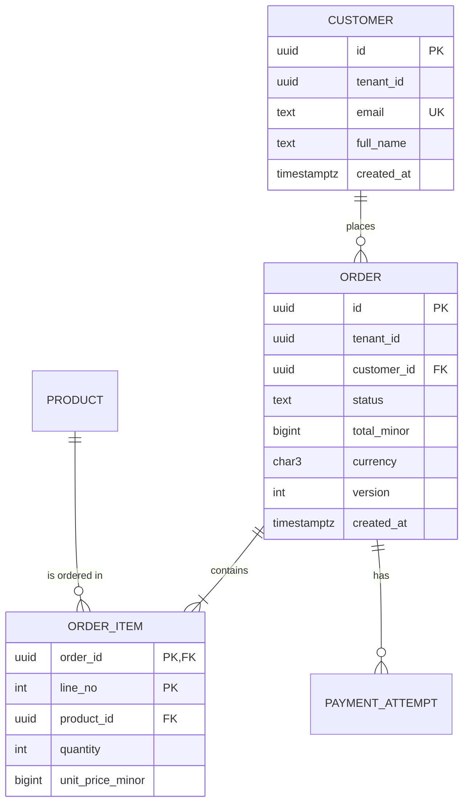

# 🗄️ Database Engineering — Production Engineering Guide

> How to model, query, change, scale, protect, and operate databases in production: choosing a datastore and version, data modelling and normalisation, data types, schema patterns (audit, soft delete, temporal, multi-tenant), indexing, query optimisation, transactions and isolation levels, zero-downtime migrations (expand/contract), connection pooling, replication and high availability, partitioning and sharding, backup and point-in-time recovery, database security, observability, maintenance and upgrades, caching, NoSQL modelling, search and vectors, data lifecycle and privacy, and ORM guidance. PostgreSQL is used as the primary example; differences for MySQL, SQL Server, and NoSQL stores are noted.
>
> Related: [04 Data architecture §11](./04-software-architecture.md#11-data-architecture) · [05 Design (optimistic locking, idempotency)](./05-software-design.md) · [06 SQL standards §19](./06-coding-standards.md#19-sql) · [08 Integration testing with Testcontainers](./08-testing-and-quality.md#17-integration-testing-with-real-dependencies) · [09 Security](./09-security-engineering.md) · [20 Reliability & DR](./20-reliability-and-disaster-recovery.md) · [39 VPS setup (PostgreSQL install/hardening)](./39-vps-enterprise-setup-guide.md)

---

## 📚 Table of Contents

1. [Principles](#1-principles)
2. [Choosing a Datastore and Version](#2-choosing-a-datastore-and-version)
3. [Data Modelling](#3-data-modelling)
4. [Normalisation and Denormalisation](#4-normalisation-and-denormalisation)
5. [Keys, Constraints, and Data Types](#5-keys-constraints-and-data-types)
6. [Schema Design Patterns](#6-schema-design-patterns)
7. [Indexing](#7-indexing)
8. [Query Optimisation](#8-query-optimisation)
9. [Transactions, Isolation, and Locking](#9-transactions-isolation-and-locking)
10. [Schema Migrations and Zero-Downtime Changes](#10-schema-migrations-and-zero-downtime-changes)
11. [Connection Management](#11-connection-management)
12. [Replication and High Availability](#12-replication-and-high-availability)
13. [Partitioning and Sharding](#13-partitioning-and-sharding)
14. [Backup and Recovery](#14-backup-and-recovery)
15. [Database Security](#15-database-security)
16. [Observability](#16-observability)
17. [Maintenance and Upgrades](#17-maintenance-and-upgrades)
18. [Caching with Redis / Valkey](#18-caching-with-redis--valkey)
19. [NoSQL Data Modelling](#19-nosql-data-modelling)
20. [Search and Vector Data](#20-search-and-vector-data)
21. [Data Lifecycle, Quality, and Privacy](#21-data-lifecycle-quality-and-privacy)
22. [ORMs and Data Access Layers](#22-orms-and-data-access-layers)
23. [Scenario Playbooks](#23-scenario-playbooks)
24. [Checklists](#24-checklists)
25. [References](#25-references)

---

## 1. Principles

| # | Principle |
|---:|---|
| 1 | **Data outlives code.** Schemas, data quality, and migrations deserve more care than application code. |
| 2 | **The database enforces integrity** — constraints, types, and foreign keys are not optional "because the app validates". |
| 3 | **One owner per dataset** — a service/module owns its tables; others use APIs or events (chapter 04 §11.2). |
| 4 | **Every change is a migration** — versioned, reviewed, reversible in intent, and zero-downtime by default. |
| 5 | **Measure before tuning** — use `EXPLAIN (ANALYZE, BUFFERS)` and query statistics, not intuition. |
| 6 | **Backups don't exist until a restore has been tested.** |
| 7 | **Least privilege** — applications never connect as superuser or schema owner. |
| 8 | **Boring technology wins** — choose the datastore your team can operate at 3 a.m. |

---

## 2. Choosing a Datastore and Version

Datastore type selection: chapter 04 §11.1. Default recommendation: **PostgreSQL** for OLTP unless a specific need says otherwise.

### 2.1 Version status (verify on vendor lifecycle pages before production decisions)

| Database | Status as of October 2026 |
|---|---|
| **PostgreSQL** | **18** is the current stable major release (Sept 2025) and the version referenced across this repo. **PostgreSQL 19** reached Beta 4 on 24 Sept 2026; the project planned a release candidate in early October with general availability possibly in October 2026, and several originally planned features were reverted during beta. Each major version is supported for 5 years. |
| **MySQL** | Use the current **LTS** line (8.4 LTS) for production; Innovation releases are for testing new features. Check Oracle's lifecycle page — MySQL 8.0 reached end of life. |
| **MariaDB** | Use a current LTS release. |
| **SQL Server** | Use a supported version per Microsoft's lifecycle policy. |
| **MongoDB** | Use a currently supported major version (Atlas manages upgrades). |
| **Redis / Valkey** | Valkey is the Linux Foundation fork of Redis under BSD licence; Redis has its own licensing — check licence terms for your use case. |

> Rule: run a **supported major version** with the **latest minor/patch release**. PostgreSQL minor releases (security and bug fixes) ship at least quarterly — apply them promptly.

### 2.2 Managed vs self-managed

| | Managed (RDS/Aurora, Cloud SQL/AlloyDB, Azure Database for PostgreSQL, Neon, Supabase, Crunchy Bridge…) | Self-managed (VM/VPS/Kubernetes operators) |
|---|---|---|
| Backups, PITR, failover | Built in | You build and test them |
| Patching | Automated windows | You schedule |
| Extensions & config | Restricted to provider's list | Full control |
| Cost | Higher per resource; lower ops cost | Lower infra cost; higher ops cost |
| Best for | Most teams | Specialised needs, cost-sensitive at scale, strong DBA skills |

Self-managed on a single server: **39-vps-enterprise-setup-guide.md**. On Kubernetes: operators such as CloudNativePG, Crunchy PGO, or Zalando's operator.

---

## 3. Data Modelling

### 3.1 Three levels

| Level | Content | Audience |
|---|---|---|
| **Conceptual** | Entities and relationships in business terms | Business, product |
| **Logical** | Attributes, keys, normalised relations, cardinalities (DB-agnostic) | Engineers, analysts |
| **Physical** | Tables, types, indexes, partitions, constraints for a specific DBMS | Engineers, DBAs |

### 3.2 ER diagram (Mermaid)



### 3.3 Modelling rules

```text
🔴 Model the domain's invariants explicitly (constraints), not just its shape
🔴 Use the ubiquitous language for table/column names (chapter 04 §7)
🔴 Store money as integer minor units or NUMERIC with currency code; time as timestamptz in UTC
🟠 Model state explicitly (status column with CHECK constraint or enum + transitions in code — chapter 05 §13)
🟠 Prefer narrow, purpose-specific tables to "god tables" with dozens of nullable columns
🟠 Keep reference data (countries, currencies) in tables with stable codes (ISO 3166, ISO 4217)
```

---

## 4. Normalisation and Denormalisation

| Normal form | Rule (summary) | Violation example |
|---|---|---|
| **1NF** | Atomic values; no repeating groups | `phone_numbers = "98..., 99..."` |
| **2NF** | 1NF + no partial dependency on part of a composite key | `order_items(order_id, line_no, customer_name)` |
| **3NF** | 2NF + no transitive dependencies (non-key → non-key) | `orders(customer_id, customer_city)` |
| **BCNF** | Every determinant is a candidate key | Rare edge cases in overlapping keys |

**Default: design OLTP schemas in 3NF**, then denormalise deliberately:

| Denormalisation | When | Keep consistent via |
|---|---|---|
| Snapshot values (price at order time, address at shipment) | Values must not change when source changes — this is actually *correct* modelling of history | Write once |
| Counters / aggregates (`orders_count`) | Hot read path | Triggers, transactional updates, or async recompute |
| Read models / materialised views | Complex queries, dashboards | `REFRESH MATERIALIZED VIEW CONCURRENTLY`, CDC, CQRS projections |
| JSONB for flexible attributes | Sparse, variable attributes (product specs) | JSON Schema validation in app; GIN indexes; promote hot fields to columns |

---

## 5. Keys, Constraints, and Data Types

### 5.1 Primary keys

| Option | Notes |
|---|---|
| `bigint GENERATED ALWAYS AS IDENTITY` | Compact, fast; fine for internal tables; don't expose sequential IDs publicly if enumeration matters |
| `uuid` (v7 preferred for new systems) | Globally unique, index-friendly when time-ordered (RFC 9562). PostgreSQL 18 adds a built-in `uuidv7()` function; on older versions generate in the application or via extension |
| Natural keys (ISO codes, SKU) | Use as unique constraints; rarely as PKs if they can change |

> Many teams use a `bigint` internal PK plus a public opaque ID (`uuid`/prefixed string like `ord_7f3k…`) exposed in APIs.

### 5.2 Constraints — the database is the last line of defence

```sql
CREATE TABLE orders (
    id            uuid PRIMARY KEY DEFAULT uuidv7(),          -- PostgreSQL 18+; otherwise app-generated
    tenant_id     uuid        NOT NULL,
    customer_id   uuid        NOT NULL REFERENCES customers(id),
    status        text        NOT NULL CHECK (status IN ('created','payment_pending','payment_failed','paid','shipped','cancelled','refunded')),
    total_minor   bigint      NOT NULL CHECK (total_minor >= 0),
    currency      char(3)     NOT NULL CHECK (currency ~ '^[A-Z]{3}$'),
    version       integer     NOT NULL DEFAULT 0,
    created_at    timestamptz NOT NULL DEFAULT now(),
    updated_at    timestamptz NOT NULL DEFAULT now()
);
CREATE INDEX ix_orders_tenant_customer_created ON orders (tenant_id, customer_id, created_at DESC);

CREATE TABLE order_items (
    order_id          uuid    NOT NULL REFERENCES orders(id) ON DELETE CASCADE,
    line_no           integer NOT NULL CHECK (line_no > 0),
    product_id        uuid    NOT NULL REFERENCES products(id),
    quantity          integer NOT NULL CHECK (quantity BETWEEN 1 AND 100),
    unit_price_minor  bigint  NOT NULL CHECK (unit_price_minor >= 0),
    PRIMARY KEY (order_id, line_no)
);
CREATE INDEX ix_order_items_product ON order_items (product_id);   -- index FKs used in joins/deletes
```

| Constraint | Use |
|---|---|
| `NOT NULL` | Default for every column unless absence is meaningful |
| `PRIMARY KEY` / `UNIQUE` | Identity and natural uniqueness (`UNIQUE (tenant_id, email)`) |
| `FOREIGN KEY` | Referential integrity; **index the referencing columns** |
| `CHECK` | Domain rules (ranges, formats, enumerations) |
| `EXCLUDE` (PostgreSQL) | No overlapping ranges (bookings) |
| Partial unique index | Uniqueness under conditions (`UNIQUE (email) WHERE deleted_at IS NULL`) |

### 5.3 Data types (PostgreSQL guidance)

| Data | Use | Avoid |
|---|---|---|
| Timestamps | `timestamptz` | `timestamp` without time zone for instants |
| Dates (calendar) | `date` | Strings |
| Money | `bigint` minor units or `numeric(19,4)` + currency | `float`, `real`, `money` type |
| Text | `text` (+ `CHECK (length(x) <= n)` if needed) | Arbitrary `varchar(255)` habits |
| Booleans | `boolean NOT NULL DEFAULT false` | `char(1)` Y/N |
| IDs | `bigint`, `uuid` | `int` for large tables (overflow at ~2.1 B) |
| Enumerations | `text` + `CHECK`, or lookup table; PostgreSQL `enum` when values are very stable | Magic integers |
| Semi-structured | `jsonb` | `json` (except to preserve exact formatting), text blobs |
| IP / network | `inet`, `cidr` | Strings |
| Ranges | `tstzrange`, `daterange`, `int4range` | Two columns without constraints |
| Binary files | Object storage + metadata row | Large `bytea` blobs in OLTP tables |

---

## 6. Schema Design Patterns

### 6.1 Audit columns

```sql
created_at  timestamptz NOT NULL DEFAULT now(),
created_by  uuid,
updated_at  timestamptz NOT NULL DEFAULT now(),
updated_by  uuid
-- maintain updated_at via application or trigger
```

### 6.2 Soft delete vs hard delete

| Approach | Pros | Cons |
|---|---|---|
| Hard delete | Simple; supports erasure obligations | No undo; history lost |
| Soft delete (`deleted_at`) | Undo, audit | Every query must filter; unique constraints need partial indexes; personal data still stored (privacy!) |
| Archive table / event log | History without polluting hot tables | More moving parts |

```sql
CREATE UNIQUE INDEX ux_customers_tenant_email_active ON customers (tenant_id, lower(email)) WHERE deleted_at IS NULL;
```

> Soft-deleted personal data is still personal data: erasure requests (GDPR/DPDP) need real deletion or irreversible anonymisation.

### 6.3 History / temporal data

| Pattern | Use |
|---|---|
| History table + trigger | Full row versions with valid_from/valid_to |
| Event table (append-only) | Domain events as source of truth (event sourcing) or audit |
| `tstzrange` validity + `EXCLUDE` constraint | Non-overlapping periods (prices, contracts) |
| Temporal features | PostgreSQL 18 added `WITHOUT OVERLAPS` for temporal primary/unique keys; SQL Server and MariaDB support system-versioned tables |

### 6.4 Multi-tenancy in the schema

```text
Shared tables:     tenant_id on every tenant-scoped table, leading column in indexes, RLS as defense in depth
Schema-per-tenant: search_path per connection; migrations run per schema (tooling!)
DB-per-tenant:     strongest isolation; fleet management for migrations, backups, monitoring
```

See chapter 04 §13.4 and chapter 09 §10.4 (row-level security).

### 6.5 Anti-patterns

| Anti-pattern | Problem | Better |
|---|---|---|
| Entity–Attribute–Value (EAV) | No types/constraints, slow queries | Columns + `jsonb` for truly dynamic attributes |
| Polymorphic FK (`target_type`, `target_id`) | No referential integrity | Separate FK columns with CHECK that exactly one is set, or separate join tables |
| Comma-separated lists | Violates 1NF | Join table or array type (with care) |
| Storing derived totals without a rule | Drift | Compute, or maintain transactionally |
| One giant `status` + many booleans | Invalid combinations | Explicit state column + transition rules |

---

## 7. Indexing

### 7.1 PostgreSQL index types

| Type | Good for |
|---|---|
| **B-tree** (default) | Equality, range, sorting, prefix `LIKE 'abc%'` (with appropriate collation/opclass) |
| **Hash** | Equality only (rarely better than B-tree) |
| **GIN** | `jsonb` containment, arrays, full-text search (`tsvector`), trigram (`pg_trgm`) |
| **GiST** | Ranges, geometric/PostGIS, exclusion constraints, nearest-neighbour |
| **SP-GiST** | Partitioned search spaces (IP ranges, quad-trees) |
| **BRIN** | Very large, naturally ordered tables (time-series append-only) — tiny indexes |

### 7.2 Composite index rules

```text
1. Equality columns first, then range/sort columns:  (tenant_id, status, created_at)
2. Leftmost-prefix rule: index (a, b, c) helps queries on a; a,b; a,b,c — not b alone
3. Match ORDER BY direction for top-N queries: (tenant_id, created_at DESC)
4. Covering index: INCLUDE columns to enable index-only scans
5. Partial index for hot subsets: WHERE status = 'payment_pending'
6. Expression index for computed predicates: lower(email)
```

```sql
-- Top-N recent orders per customer, index-only friendly
CREATE INDEX ix_orders_cust_recent ON orders (tenant_id, customer_id, created_at DESC) INCLUDE (status, total_minor);

-- Hot subset only
CREATE INDEX ix_orders_pending ON orders (created_at) WHERE status = 'payment_pending';

-- Case-insensitive lookup
CREATE UNIQUE INDEX ux_customers_email ON customers (tenant_id, lower(email));

-- JSONB containment
CREATE INDEX ix_products_attrs ON products USING gin (attributes jsonb_path_ops);
```

### 7.3 Index hygiene

```text
🔴 Create indexes on large live tables with CREATE INDEX CONCURRENTLY (no write blocking)
🔴 Index foreign keys used in joins and ON DELETE cascades
🟠 Remove unused indexes (pg_stat_user_indexes.idx_scan = 0 over a representative period) — every index slows writes
🟠 Watch for duplicate/overlapping indexes
🟠 Monitor bloat; REINDEX CONCURRENTLY when needed
```

```sql
-- Unused indexes (review over weeks, including month-end jobs, before dropping)
SELECT schemaname, relname AS table, indexrelname AS index, idx_scan,
       pg_size_pretty(pg_relation_size(indexrelid)) AS size
FROM pg_stat_user_indexes
WHERE idx_scan = 0
ORDER BY pg_relation_size(indexrelid) DESC;
```

---

## 8. Query Optimisation

### 8.1 Workflow

```text
1. Find expensive queries: pg_stat_statements (total time, calls, mean, rows), slow query logs, APM traces
2. Reproduce with realistic data volume and parameters
3. EXPLAIN (ANALYZE, BUFFERS) — read actual vs estimated rows, loops, buffers, sort/hash spills
4. Fix: index, rewrite, reduce data scanned, update statistics, adjust schema
5. Verify improvement; add a regression check (benchmark or query-count assertion)
```

```sql
CREATE EXTENSION IF NOT EXISTS pg_stat_statements;   -- also requires shared_preload_libraries
SELECT left(query, 120) AS query, calls, round(total_exec_time) AS total_ms,
       round(mean_exec_time, 2) AS mean_ms, rows
FROM pg_stat_statements
ORDER BY total_exec_time DESC
LIMIT 20;

EXPLAIN (ANALYZE, BUFFERS, VERBOSE)
SELECT id, status, total_minor FROM orders
WHERE tenant_id = $1 AND customer_id = $2
ORDER BY created_at DESC LIMIT 20;
```

### 8.2 Reading plans — red flags

| Red flag | Likely fix |
|---|---|
| `Seq Scan` on a large table for a selective filter | Add/adjust index; check predicate is sargable |
| Estimated rows ≪ actual rows | `ANALYZE`; extended statistics (`CREATE STATISTICS`) for correlated columns |
| `Sort` with `external merge Disk` | Index for ORDER BY; increase `work_mem` for that query/session carefully |
| Nested loop with huge inner loops | Missing index on join key; rewrite |
| Function on indexed column (`WHERE date(created_at) = …`) | Range predicate or expression index |
| Large `OFFSET` | Keyset pagination |

### 8.3 Common query anti-patterns

```text
❌ N+1 queries from ORMs           → eager loading / batch fetch / joins (assert query counts in tests)
❌ SELECT *                        → explicit columns (enables index-only scans, stable contracts)
❌ OFFSET 100000 LIMIT 20          → keyset pagination
❌ Leading-wildcard LIKE '%abc'    → trigram index (pg_trgm) or full-text search
❌ OR across different columns     → UNION ALL of indexable queries, or restructure
❌ NOT IN (subquery with NULLs)    → NOT EXISTS
❌ Implicit casts on indexed columns → match types
❌ Unbounded queries               → always LIMIT / paginate
```

### 8.4 Keyset (cursor) pagination

```sql
-- First page
SELECT id, created_at, status FROM orders
WHERE tenant_id = $1
ORDER BY created_at DESC, id DESC
LIMIT 20;

-- Next page: pass the last (created_at, id) as an opaque cursor
SELECT id, created_at, status FROM orders
WHERE tenant_id = $1
  AND (created_at, id) < ($2, $3)
ORDER BY created_at DESC, id DESC
LIMIT 20;
```

---

## 9. Transactions, Isolation, and Locking

### 9.1 ACID

**A**tomicity (all or nothing) · **C**onsistency (constraints hold) · **I**solation (concurrent transactions don't interfere beyond the chosen level) · **D**urability (committed data survives crashes).

### 9.2 Isolation levels and anomalies (SQL standard; PostgreSQL behaviour)

| Level | Dirty read | Non-repeatable read | Phantom | Serialization anomaly | PostgreSQL notes |
|---|:---:|:---:|:---:|:---:|---|
| Read uncommitted | possible* | possible | possible | possible | Behaves as Read committed in PostgreSQL |
| **Read committed** (default) | ❌ | possible | possible | possible | Each statement sees a fresh snapshot |
| Repeatable read | ❌ | ❌ | ❌ in PostgreSQL | possible | Snapshot per transaction; may raise serialization failures on conflicting updates |
| **Serializable** | ❌ | ❌ | ❌ | ❌ | SSI; application **must retry** on SQLSTATE `40001` |

`*` Not in PostgreSQL. MySQL InnoDB defaults to **Repeatable read** with different locking semantics — know your engine.

### 9.3 Concurrency control patterns

| Pattern | SQL | Use |
|---|---|---|
| **Optimistic locking** | `UPDATE … SET …, version = version + 1 WHERE id = $1 AND version = $2` | Low contention; user edits |
| **Pessimistic row lock** | `SELECT … FOR UPDATE` | High contention on specific rows (inventory) |
| **Job queue claim** | `SELECT … FOR UPDATE SKIP LOCKED LIMIT 10` | Workers pulling jobs from a table |
| **Atomic conditional update** | `UPDATE inventory SET available = available - $2 WHERE product_id = $1 AND available >= $2` | Avoid read-modify-write races |
| **Advisory locks** | `pg_try_advisory_xact_lock(key)` | Coordinating singleton tasks |
| **Unique constraints** | `INSERT … ON CONFLICT DO NOTHING/UPDATE` | Idempotency, deduplication |

```sql
-- Job queue with SKIP LOCKED
WITH next_jobs AS (
  SELECT id FROM jobs
  WHERE status = 'queued' AND run_at <= now()
  ORDER BY run_at
  FOR UPDATE SKIP LOCKED
  LIMIT 10
)
UPDATE jobs j SET status = 'running', started_at = now()
FROM next_jobs n WHERE j.id = n.id
RETURNING j.*;
```

### 9.4 Transaction rules

```text
🔴 Keep transactions short; never hold a transaction open across network calls or user think time
🔴 Set statement_timeout and idle_in_transaction_session_timeout (per role or session)
🔴 Acquire locks in a consistent order to avoid deadlocks; retry on deadlock (40P01) and serialization (40001) errors
🟠 Use the transactional outbox to publish events reliably (chapter 04 §11.3)
🟠 Log lock waits (log_lock_waits = on) and monitor pg_locks / pg_stat_activity for blocking
```

---

## 10. Schema Migrations and Zero-Downtime Changes

### 10.1 Tools

| Ecosystem | Migration tools |
|---|---|
| Java/Kotlin | **Flyway**, **Liquibase** |
| .NET | EF Core Migrations, DbUp, FluentMigrator |
| Python | **Alembic** (SQLAlchemy), Django migrations |
| Node.js/TS | Prisma Migrate, Knex, TypeORM, Drizzle Kit, node-pg-migrate |
| Go | golang-migrate, Atlas, goose |
| Ruby | Rails Active Record migrations |
| PHP | Laravel migrations, Doctrine Migrations |
| Polyglot / declarative | **Atlas**, Sqitch, Bytebase |
| Safety linting | squawk (PostgreSQL migration linter), Atlas lint |

### 10.2 Migration rules

```text
🔴 Migrations are versioned files in Git, reviewed like code (CODEOWNERS: DB reviewers — chapter 07 §10.6)
🔴 Applied by the pipeline, not by hand; same migrations in every environment
🔴 Forward-only in production (write a new migration to undo; "down" scripts are for local dev)
🔴 Backward compatible with the currently running application version (expand/contract)
🔴 Set lock_timeout (e.g. 3–5 s) in migrations so DDL fails fast instead of queueing behind long transactions
🟠 Test migrations against a production-sized copy (masked) for duration and locking
🟠 Separate schema changes from large data backfills
```

### 10.3 Expand / migrate / contract

```text
Release N   (EXPAND):   add new column/table (nullable or with safe default); app writes both old and new
Background  (MIGRATE):  backfill in batches; verify
Release N+1 (SWITCH):   app reads new; still writes both (optional)
Release N+2 (CONTRACT): stop writing old; drop old column/table after a safe period
```

### 10.4 Safe vs risky operations (PostgreSQL)

| Change | Risk | Safe approach |
|---|---|---|
| Add nullable column | ✅ Safe (metadata only) | — |
| Add column with constant default | ✅ Safe on PostgreSQL 11+ (no table rewrite) | — |
| Add column with volatile default | ⚠️ Rewrite | Add nullable, backfill in batches, then set default |
| Create index | ⚠️ Blocks writes | `CREATE INDEX CONCURRENTLY` (not inside a transaction block) |
| Add foreign key | ⚠️ Validates whole table under lock | `ADD CONSTRAINT … NOT VALID` then `VALIDATE CONSTRAINT` |
| Add CHECK constraint | ⚠️ Scan under lock | `NOT VALID` then `VALIDATE CONSTRAINT` |
| Set NOT NULL | ⚠️ Scan | Add `CHECK (col IS NOT NULL) NOT VALID`, validate, then `SET NOT NULL` (uses the validated check, PostgreSQL 12+) |
| Change column type | ❌ Often rewrite + exclusive lock | New column + dual write + backfill + switch |
| Rename column/table | ❌ Breaks running app | Expand/contract (new name, views, or dual write) |
| Drop column | ⚠️ Breaks app still reading it | Stop using in code first (contract phase), then drop |

```sql
-- Example: add FK safely
SET lock_timeout = '5s';
ALTER TABLE payment_attempts ADD CONSTRAINT fk_attempts_order
  FOREIGN KEY (order_id) REFERENCES orders(id) NOT VALID;
ALTER TABLE payment_attempts VALIDATE CONSTRAINT fk_attempts_order;   -- lighter lock, can run while traffic flows

-- Example: batched backfill (run repeatedly from a job until 0 rows updated)
UPDATE orders SET currency = 'INR'
WHERE id IN (SELECT id FROM orders WHERE currency IS NULL LIMIT 5000);
```

---

## 11. Connection Management

### 11.1 Why pooling matters

Each PostgreSQL connection is a backend process with memory overhead. Thousands of direct connections (e.g. from many app instances or serverless functions) exhaust memory and degrade performance.

| Layer | Tools |
|---|---|
| Application pool | HikariCP (JVM), `pgxpool` (Go), `asyncpg`/SQLAlchemy pools (Python), `node-postgres` Pool, Npgsql pooling (.NET) |
| External pooler | **PgBouncer** (transaction pooling), PgCat, Supavisor, managed proxies (RDS Proxy, Cloud SQL connectors, Azure PgBouncer) |

### 11.2 Sizing guidance

```text
Total DB connections = Σ (app instances × pool size per instance) + admin/migration headroom
Keep it well below max_connections; size pools by measuring, starting small.

A widely cited starting heuristic for a database server (from HikariCP's pool-sizing notes):
  connections ≈ (CPU cores × 2) + effective spindle count
Treat it as a starting point; SSD/NVMe and workload shape change the optimum — load-test.
```

### 11.3 PgBouncer transaction pooling caveats

Session state is not preserved between transactions: avoid session-level `SET`, advisory session locks, `LISTEN/NOTIFY`, temporary tables across transactions, and (depending on version/config) server-side prepared statements. Recent PgBouncer releases support protocol-level prepared statements in transaction mode when configured — check your version.

### 11.4 Timeouts (per application role)

```sql
ALTER ROLE app_orders SET statement_timeout = '5s';
ALTER ROLE app_orders SET idle_in_transaction_session_timeout = '30s';
ALTER ROLE app_orders SET lock_timeout = '2s';
```

---

## 12. Replication and High Availability

### 12.1 PostgreSQL replication types

| Type | How | Use |
|---|---|---|
| **Streaming (physical) replication** | WAL shipped to standbys; byte-identical copies | HA failover, read replicas |
| Synchronous replication | Commit waits for standby confirmation | Zero data loss (RPO 0) at latency cost |
| **Logical replication** | Row changes per table via publications/subscriptions | Major-version upgrades, selective replication, CDC, migrations |
| CDC tools | Debezium (logical decoding) → Kafka | Event streaming, read models |

### 12.2 HA approaches

| Approach | Notes |
|---|---|
| Managed HA (multi-AZ) | Automatic failover; recommended default in cloud |
| **Patroni** (+ etcd/Consul) | De-facto open-source HA for self-managed PostgreSQL |
| Kubernetes operators (CloudNativePG, Crunchy PGO) | HA, backups, rolling updates as Kubernetes resources |
| MySQL | InnoDB Cluster / Group Replication; managed services |
| SQL Server | Always On availability groups |

### 12.3 Read replicas — caveats

```text
- Replication lag: replicas can be seconds behind; don't read-your-own-writes from a replica
- Route reads explicitly (query-level or service-level), not blindly
- Monitor lag (pg_stat_replication / replica metrics) and alert
- Long queries on replicas can conflict with WAL replay (hot_standby_feedback trade-offs)
```

---

## 13. Partitioning and Sharding

### 13.1 Declarative partitioning (PostgreSQL)

| Strategy | Use |
|---|---|
| **Range** | Time-series (by month/day), archival by dropping old partitions |
| **List** | By region/tenant tier |
| **Hash** | Even spread when no natural range |

```sql
CREATE TABLE events (
    id          uuid NOT NULL,
    tenant_id   uuid NOT NULL,
    occurred_at timestamptz NOT NULL,
    payload     jsonb NOT NULL,
    PRIMARY KEY (id, occurred_at)
) PARTITION BY RANGE (occurred_at);

CREATE TABLE events_2026_10 PARTITION OF events
  FOR VALUES FROM ('2026-10-01') TO ('2026-11-01');
-- Automate partition creation/retention with pg_partman or a scheduled job.
-- Retention: DROP TABLE events_2025_10;  (instant, unlike DELETE)
```

When to partition: very large tables (hundreds of GB+), time-based retention, maintenance windows too long, or queries that naturally prune by the partition key. Partitioning adds planning overhead and constraints (PK must include the partition key) — don't partition small tables.

### 13.2 Sharding

| Option | Notes |
|---|---|
| Vertical split first | Move modules/tables to separate databases (chapter 04) |
| **Citus** (PostgreSQL extension) | Distributed tables by shard key (often `tenant_id`) |
| **Vitess** | Sharding for MySQL at large scale |
| Distributed SQL (CockroachDB, YugabyteDB, Spanner) | Built-in distribution; different trade-offs and costs |
| Application-level sharding | Maximum control; maximum complexity |

```text
Before sharding, exhaust: query/index tuning → bigger instance → read replicas → caching →
partitioning → splitting by module. Choose shard keys that keep most queries single-shard (e.g. tenant_id).
```

---

## 14. Backup and Recovery

### 14.1 Objectives

| Term | Definition | Example |
|---|---|---|
| **RPO** | Max acceptable data loss | 5 minutes |
| **RTO** | Max acceptable time to restore service | 30 minutes |

### 14.2 Backup types (PostgreSQL)

| Type | Tool | Use |
|---|---|---|
| Logical dump | `pg_dump` / `pg_dumpall` | Small DBs, migrations, per-table restores; not PITR |
| Physical base backup + WAL archiving | **pgBackRest**, Barman, WAL-G, `pg_basebackup` | Production PITR |
| Incremental backups | PostgreSQL 17+ native incremental `pg_basebackup`; pgBackRest incremental/differential | Faster backups of large DBs |
| Managed snapshots + PITR | Cloud providers | Default for managed DBs |
| Storage snapshots | Volume snapshots | Fast; must be crash-consistent with WAL |

### 14.3 3-2-1(-1-0) rule

**3** copies of data, on **2** different media/storage types, **1** off-site (different region/account), **1** offline or immutable (ransomware protection), **0** errors after automated restore verification.

### 14.4 Restore testing (non-negotiable)

```text
🔴 Automated restore of the latest backup to an isolated environment at least weekly (daily for critical)
🔴 Measure actual restore time vs RTO; verify row counts/checksums/application smoke tests
🔴 Practise PITR to a specific timestamp (e.g. "just before the bad migration")
🟠 Backups encrypted; backup credentials separate from production credentials
🟠 Document runbooks; rehearse in DR drills (chapter 20)
```

```bash
# pgBackRest essentials (illustrative)
pgbackrest --stanza=main --type=full backup
pgbackrest --stanza=main --type=diff backup
pgbackrest --stanza=main info
pgbackrest --stanza=main --delta --type=time "--target=2026-10-02 09:14:00+05:30" --target-action=promote restore
```

Single-server backup scripts: **39-vps-enterprise-setup-guide.md**.

---

## 15. Database Security

| Control | Practice |
|---|---|
| **Network** | Private network only; no public endpoint (or IP allow-list + TLS if unavoidable); security groups/firewall |
| **TLS** | Require TLS for client connections (`hostssl` in `pg_hba.conf`, `sslmode=verify-full` in clients) |
| **Authentication** | SCRAM-SHA-256 (MD5 passwords are deprecated as of PostgreSQL 18 and emit warnings from 19); IAM/Entra/Cloud IAM auth on managed services where available |
| **Least privilege roles** | Separate roles: migration owner, app read-write, app read-only, analytics; app role is not owner and has no `BYPASSRLS`/superuser |
| **Row-level security** | Tenant isolation defense in depth (chapter 09 §10.4) |
| **Encryption at rest** | Storage/KMS encryption (managed services); TDE where offered; column/app-level encryption for highly sensitive fields |
| **Secrets** | Credentials in secret manager; rotation; short-lived credentials where possible |
| **Auditing** | `pgaudit` extension or managed audit logs for DDL, role changes, access to restricted tables |
| **Patching** | Apply minor releases promptly (security fixes) |
| **Data masking** | Masked copies for non-production (chapter 08 §23) |
| **Backups** | Encrypted, access-controlled, immutable copies |

```sql
-- Role layout (illustrative)
CREATE ROLE orders_owner NOLOGIN;                         -- owns schema/objects; used by migrations
CREATE ROLE orders_app LOGIN PASSWORD :'app_pw';          -- runtime role (prefer secret-managed / IAM auth)
CREATE ROLE orders_readonly NOLOGIN;

GRANT USAGE ON SCHEMA orders TO orders_app, orders_readonly;
GRANT SELECT, INSERT, UPDATE, DELETE ON ALL TABLES IN SCHEMA orders TO orders_app;
GRANT SELECT ON ALL TABLES IN SCHEMA orders TO orders_readonly;
ALTER DEFAULT PRIVILEGES FOR ROLE orders_owner IN SCHEMA orders
  GRANT SELECT, INSERT, UPDATE, DELETE ON TABLES TO orders_app;
REVOKE CREATE ON SCHEMA public FROM PUBLIC;               -- default since PostgreSQL 15, keep explicit for older DBs
```

---

## 16. Observability

### 16.1 Key metrics

| Area | Metrics |
|---|---|
| Throughput | Transactions/sec, queries/sec, rows read/written |
| Latency | Query latency percentiles (from app traces + pg_stat_statements) |
| Connections | Active, idle, idle in transaction, waiting; pool saturation |
| Resources | CPU, memory, disk IOPS/throughput, disk space, network |
| Cache | Buffer cache hit ratio (context-dependent), temp files/bytes |
| Locks | Lock waits, deadlocks, blocked sessions |
| Replication | Lag (bytes/seconds), replica state, WAL generation rate |
| Maintenance | Dead tuples, autovacuum runs, last vacuum/analyze, transaction ID age (wraparound risk) |
| Backups | Last successful backup, WAL archive status, restore test results |

### 16.2 Useful queries

```sql
-- Who is running what (and blocking whom)
SELECT pid, usename, state, wait_event_type, wait_event,
       now() - xact_start AS xact_age, pg_blocking_pids(pid) AS blocked_by, left(query, 100) AS query
FROM pg_stat_activity
WHERE state <> 'idle'
ORDER BY xact_age DESC NULLS LAST;

-- Transaction ID wraparound risk (alert well before autovacuum_freeze_max_age)
SELECT datname, age(datfrozenxid) AS xid_age FROM pg_database ORDER BY xid_age DESC;

-- Tables with most dead tuples
SELECT relname, n_live_tup, n_dead_tup, last_autovacuum, last_autoanalyze
FROM pg_stat_user_tables ORDER BY n_dead_tup DESC LIMIT 20;
```

### 16.3 Tooling

`postgres_exporter` + Prometheus + Grafana (setup in **39**), `pg_stat_statements`, `auto_explain` for slow plans, `log_min_duration_statement` for slow query logs, pgBadger for log analysis, managed insights (Performance Insights, Query Insights), APM database spans via OpenTelemetry. Details: chapter **18**.

---

## 17. Maintenance and Upgrades

### 17.1 VACUUM and ANALYZE

PostgreSQL's MVCC leaves dead row versions that **autovacuum** reclaims; **ANALYZE** updates planner statistics; **freezing** prevents transaction ID wraparound.

```text
🔴 Never disable autovacuum
🟠 Tune per hot table: autovacuum_vacuum_scale_factor (lower for big tables), cost limits, workers
🟠 Avoid long-running transactions (they block cleanup)
🟠 Monitor dead tuples, bloat, and XID age
🟡 Use pg_repack (or newer built-in repacking capabilities where available) to remove heavy bloat online
```

```sql
ALTER TABLE orders SET (autovacuum_vacuum_scale_factor = 0.02, autovacuum_analyze_scale_factor = 0.01);
```

### 17.2 Configuration starting points (PostgreSQL, dedicated server — tune by measurement)

| Parameter | Typical starting point |
|---|---|
| `shared_buffers` | ~25% of RAM |
| `effective_cache_size` | ~50–75% of RAM |
| `work_mem` | Small (e.g. 16–64 MB); raise per session/query for heavy sorts |
| `maintenance_work_mem` | Larger (e.g. 512 MB–2 GB) for vacuum/index builds |
| `random_page_cost` | ~1.1 on SSD/NVMe |
| `max_connections` | Keep modest; use pooling |
| `wal_compression` | On |
| `log_min_duration_statement` | e.g. 500 ms |
| `idle_in_transaction_session_timeout` | e.g. 60 s |

Tools like PGTune give initial values; always validate with your workload.

### 17.3 Major version upgrades

| Method | Downtime | Notes |
|---|---|---|
| `pg_upgrade --link` / `--clone` | Minutes | Fast in-place; test first; extensions must be compatible |
| Logical replication to new version | Near-zero | Set up new cluster, replicate, cut over; sequences and DDL need handling |
| Dump/restore | Long for big DBs | Simple; small databases |
| Managed blue/green upgrades | Minimal | Provider features (e.g. blue/green deployments) |

```text
Upgrade checklist:
- Read release notes "Migration" / incompatibilities section (e.g. MD5 auth deprecation, removed features)
- Check extension compatibility; upgrade extensions
- Rehearse on a production-size copy; measure downtime
- Run ANALYZE after pg_upgrade (statistics handling improved in recent versions; still verify)
- Have a rollback plan (keep old cluster until verified)
```

Plan for PostgreSQL 19 adoption after GA plus a stabilisation period (e.g. first minor release), unless you need specific features earlier.

---

## 18. Caching with Redis / Valkey

| Use | Pattern |
|---|---|
| Read-through/cache-aside for hot reads | Keys with TTL + jitter; invalidate on write |
| Sessions | TTL equal to session timeout |
| Rate limiting | Atomic counters / sliding windows (Lua scripts or built-in commands) |
| Distributed locks | Use with care (leases, fencing tokens); prefer DB constraints |
| Queues/streams | Redis/Valkey Streams for lightweight queues (consider a real broker for durability needs) |
| Leaderboards | Sorted sets |

```text
🔴 Cache is not a source of truth — design for cache loss
🔴 TTL on every key (or documented exception); namespaced keys: app:entity:id:version
🔴 maxmemory + eviction policy set (e.g. allkeys-lru for pure caches; noeviction for queues)
🟠 Prevent stampedes: jittered TTLs, request coalescing, early refresh
🟠 Auth + TLS; private network; disable dangerous commands in production (FLUSHALL, CONFIG, KEYS)
```

Design patterns: chapter 05 §17.

---

## 19. NoSQL Data Modelling

### 19.1 Core difference

```text
Relational: model the data, then write queries (normalise, join at read time)
NoSQL:      model the ACCESS PATTERNS, then shape the data (denormalise, pre-join at write time)
```

### 19.2 Document stores (MongoDB)

| Rule | Detail |
|---|---|
| Embed when | Data is read together, bounded in size, owned by the parent (order with its line items) |
| Reference when | Unbounded growth, many-to-many, independently updated (customer ↔ orders) |
| Document size | Keep well below the 16 MB limit; avoid unbounded arrays |
| Schema validation | Use `$jsonSchema` validators; version documents (`schemaVersion`) |
| Indexes | Compound indexes following the ESR rule (Equality, Sort, Range) |
| Transactions | Multi-document transactions exist but are costlier — design to need them rarely |

### 19.3 Key-value / wide-column (DynamoDB, Cassandra)

```text
1. List every access pattern (query, filters, sort, frequency, latency)
2. Choose partition key for even distribution and single-partition queries
3. Choose sort key to support range queries and hierarchical data
4. Use secondary indexes sparingly (cost, consistency)
5. DynamoDB "single-table design" can serve many entities/patterns in one table — powerful but harder to evolve
6. Avoid hot partitions (celebrity keys, time-bucket hotspots) — add write sharding suffixes if needed
```

---

## 20. Search and Vector Data

### 20.1 Full-text search

| Option | Use |
|---|---|
| PostgreSQL full-text (`tsvector`, GIN) + `pg_trgm` | Moderate search needs; keeps one datastore |
| OpenSearch / Elasticsearch | Large-scale search, facets, relevance tuning, logs |
| Meilisearch / Typesense | Developer-friendly instant search |

Keep the search index as a **derived** store updated via CDC/outbox; the OLTP DB remains the source of truth.

### 20.2 Vector search (embeddings for RAG/semantic search)

```sql
CREATE EXTENSION IF NOT EXISTS vector;          -- pgvector
CREATE TABLE doc_chunks (
  id          bigint GENERATED ALWAYS AS IDENTITY PRIMARY KEY,
  tenant_id   uuid NOT NULL,
  document_id uuid NOT NULL,
  content     text NOT NULL,
  embedding   vector(1024) NOT NULL              -- dimension must match your embedding model
);
CREATE INDEX ix_doc_chunks_embedding ON doc_chunks USING hnsw (embedding vector_cosine_ops);

-- Always filter by tenant/permissions (chapter 09 §7, LLM08)
SELECT id, content FROM doc_chunks
WHERE tenant_id = $1
ORDER BY embedding <=> $2
LIMIT 8;
```

```text
- Store model name/version with embeddings; re-embed on model change
- Combine vector + keyword (hybrid) search for better relevance
- Enforce permission filtering in the query (or pre-filtered indexes per tenant)
```

---

## 21. Data Lifecycle, Quality, and Privacy

### 21.1 Lifecycle

```text
Create → Use → Share → Archive → Delete
Each table documents: owner, classification, retention period, legal basis, deletion method
```

### 21.2 Retention and deletion

```text
🔴 Retention schedule per data category (e.g. invoices: statutory period; logs: 180 days; marketing consent: until withdrawn)
🔴 Automated deletion/archival jobs with monitoring
🔴 Erasure requests: delete or irreversibly anonymise across primary DB, replicas, caches, search indexes,
    analytics stores, and backups (backups typically expire on schedule — document this in privacy notices)
🟠 Partition by time to make retention a cheap DROP PARTITION
```

### 21.3 Data quality

| Dimension | Check |
|---|---|
| Completeness | Required fields present (NOT NULL, validation) |
| Validity | Formats/ranges (CHECK constraints) |
| Uniqueness | Unique constraints, dedup jobs |
| Consistency | FKs, reconciliation jobs between systems |
| Timeliness | Freshness SLAs for replicated/derived data |
| Accuracy | Reconciliation with sources of truth (payments vs PSP reports) |

Data contracts and pipeline tests (dbt tests, Great Expectations, Soda) for analytical data.

---

## 22. ORMs and Data Access Layers

| Ecosystem | ORMs / query builders |
|---|---|
| Java/Kotlin | JPA/Hibernate, Spring Data, jOOQ, Exposed, MyBatis |
| .NET | EF Core, Dapper |
| Python | SQLAlchemy, Django ORM, SQLModel |
| Node.js/TS | Prisma, Drizzle, TypeORM, Kysely, Knex, MikroORM |
| Go | sqlc, pgx, GORM, ent, Bun |
| PHP | Doctrine, Eloquent |
| Ruby | Active Record, Sequel |

```text
🔴 Use parameter binding always (ORMs do by default — beware raw-query escape hatches)
🔴 Detect N+1: log SQL in development; assert query counts in integration tests
🔴 Explicit transaction boundaries in the application/service layer
🟠 Don't let the ORM generate production schema automatically (use migrations)
🟠 Drop to SQL (or a typed SQL tool like jOOQ/sqlc/Kysely) for complex queries — readability over ORM gymnastics
🟠 Map to DTOs at API boundaries; never expose entities directly (mass assignment / over-exposure — chapter 09 §6)
```

---

## 23. Scenario Playbooks

### 23.1 New SaaS product
Managed PostgreSQL (multi-AZ, PITR), schema-per-module, `tenant_id` + RLS, Flyway/Alembic/Prisma migrations in CI, PgBouncer or app pools, pg_stat_statements on, automated weekly restore test, Redis/Valkey for cache/sessions.

### 23.2 High-write event/time-series data
Range partitioning by day/month with pg_partman, BRIN indexes on time, retention by dropping partitions, or a dedicated time-series store; stream to analytics via CDC.

### 23.3 Read-heavy catalogue
Read replicas + caching + search index (OpenSearch/Meilisearch) fed by CDC; strong consistency only on the write path.

### 23.4 Zero-downtime column type change on a 500 M-row table
Add new column → dual write → batched backfill with progress tracking and throttling → verify → switch reads → stop old writes → drop old column in a later release.

### 23.5 Major version upgrade with minimal downtime
Logical replication from old to new cluster → validate data and performance → short write freeze → sync sequences → cut over connection strings → keep the old cluster as rollback for a defined period.

### 23.6 Recovering from a bad migration/data corruption
Stop writes (feature flag/maintenance mode) → identify timestamp → PITR to a new instance just before the event → extract affected rows → repair production (or fail over to the restored instance) → postmortem → add migration linting/tests.

---

## 24. Checklists

### Schema review (per migration PR)
- [ ] Migration is backward compatible with the running app (expand/contract)
- [ ] `lock_timeout` set; no table-rewriting operations on large tables
- [ ] Indexes created `CONCURRENTLY`; FKs/CHECKs added `NOT VALID` then validated
- [ ] Constraints express invariants (NOT NULL, CHECK, FK, UNIQUE)
- [ ] Correct data types (timestamptz, bigint/numeric money, text, jsonb)
- [ ] FK columns indexed; query patterns have supporting indexes
- [ ] Tenant scoping (tenant_id, RLS) for tenant data
- [ ] Classification/retention noted for new personal data columns
- [ ] Tested on a production-sized masked copy (duration measured)

### Production database baseline
- [ ] Supported major version; latest minor release
- [ ] HA (multi-AZ / Patroni / operator); failover tested
- [ ] PITR backups; encrypted; off-site/immutable copy; automated restore tests
- [ ] TLS required; SCRAM auth; private network
- [ ] Least-privilege roles; app is not owner/superuser
- [ ] Connection pooling; role-level timeouts
- [ ] pg_stat_statements, slow query logging, exporter + dashboards + alerts (lag, connections, disk, XID age, backups)
- [ ] Autovacuum healthy; bloat monitored
- [ ] Runbooks: failover, restore, PITR, major upgrade

---

## 25. References

### PostgreSQL
- PostgreSQL documentation: https://www.postgresql.org/docs/current/
- PostgreSQL versioning policy: https://www.postgresql.org/support/versioning/
- PostgreSQL roadmap: https://www.postgresql.org/developer/roadmap/
- PostgreSQL 19 Beta 4 announcement: https://www.postgresql.org/about/news/postgresql-19-beta-4-3386/
- PostgreSQL 19 release notes (in progress): https://www.postgresql.org/docs/19/release-19.html
- Explicit locking: https://www.postgresql.org/docs/current/explicit-locking.html
- Transaction isolation: https://www.postgresql.org/docs/current/transaction-iso.html
- Routine vacuuming: https://www.postgresql.org/docs/current/routine-vacuuming.html
- pgBackRest: https://pgbackrest.org/ · Patroni: https://patroni.readthedocs.io/ · PgBouncer: https://www.pgbouncer.org/
- CloudNativePG: https://cloudnative-pg.io/ · pg_partman: https://github.com/pgpartman/pg_partman
- pgvector: https://github.com/pgvector/pgvector · pgaudit: https://www.pgaudit.org/
- squawk (migration linter): https://squawkhq.com/

### Other databases and tools
- MySQL documentation & lifecycle: https://dev.mysql.com/doc/
- MongoDB data modelling: https://www.mongodb.com/docs/manual/data-modeling/
- Amazon DynamoDB best practices: https://docs.aws.amazon.com/amazondynamodb/latest/developerguide/best-practices.html
- Valkey: https://valkey.io/ · Redis: https://redis.io/docs/
- Flyway: https://documentation.red-gate.com/flyway · Liquibase: https://docs.liquibase.com/ · Alembic: https://alembic.sqlalchemy.org/ · Atlas: https://atlasgo.io/
- Debezium: https://debezium.io/
- HikariCP pool sizing: https://github.com/brettwooldridge/HikariCP/wiki/About-Pool-Sizing
- Use The Index, Luke (SQL indexing guide): https://use-the-index-luke.com/

### Books
- *Designing Data-Intensive Applications* — Martin Kleppmann
- *Database Internals* — Alex Petrov
- *SQL Performance Explained* — Markus Winand
- *The Art of PostgreSQL* — Dimitri Fontaine

---

**Previous:** [09 — Security Engineering](./09-security-engineering.md) · **Next:** [11 — API & Integration](./11-api-and-integration.md)